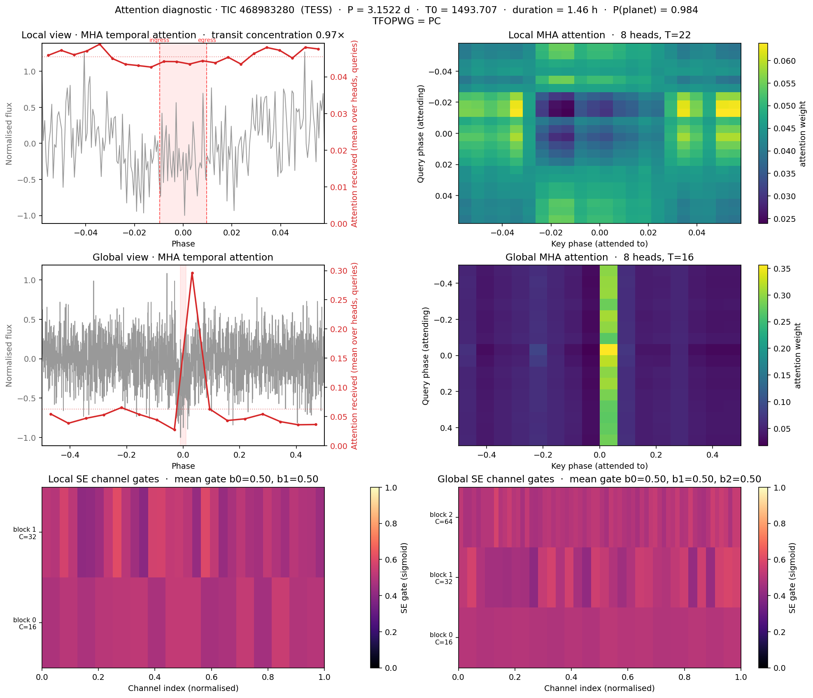
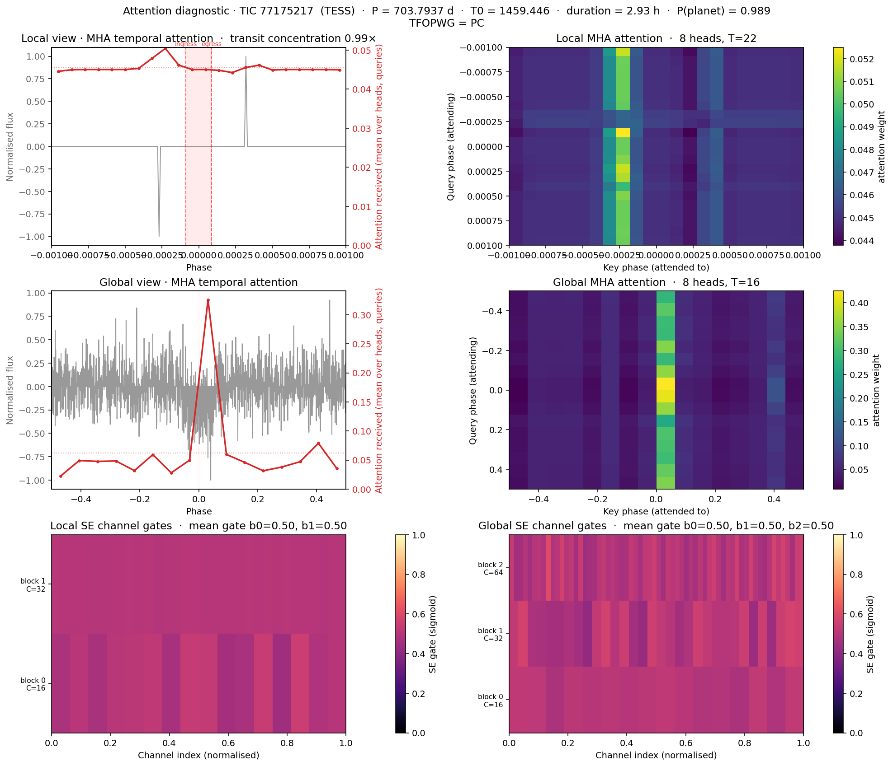
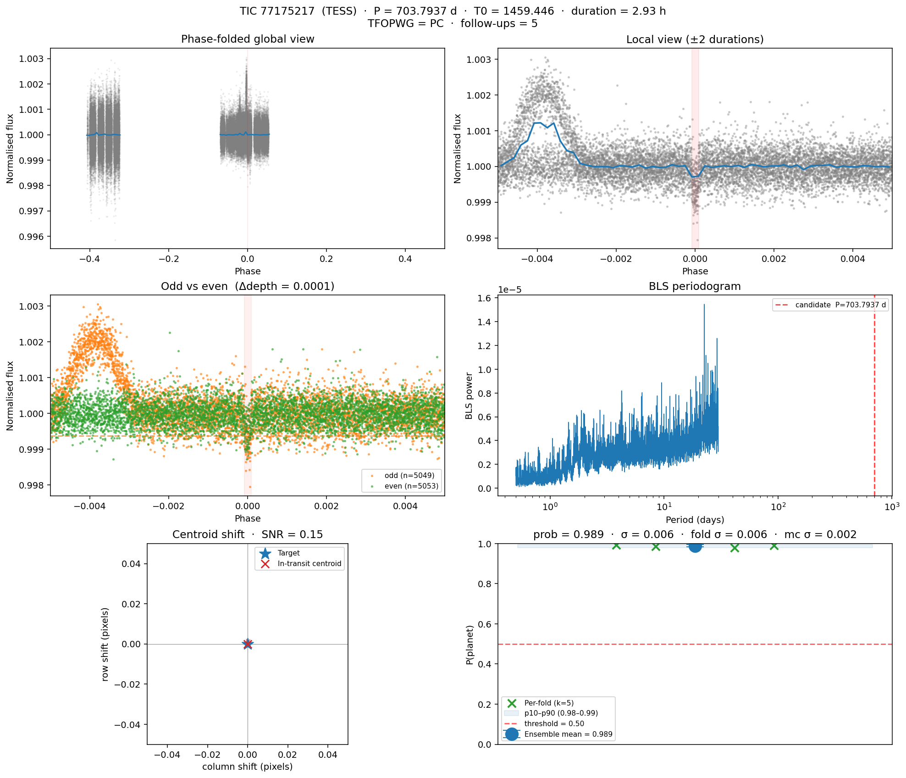
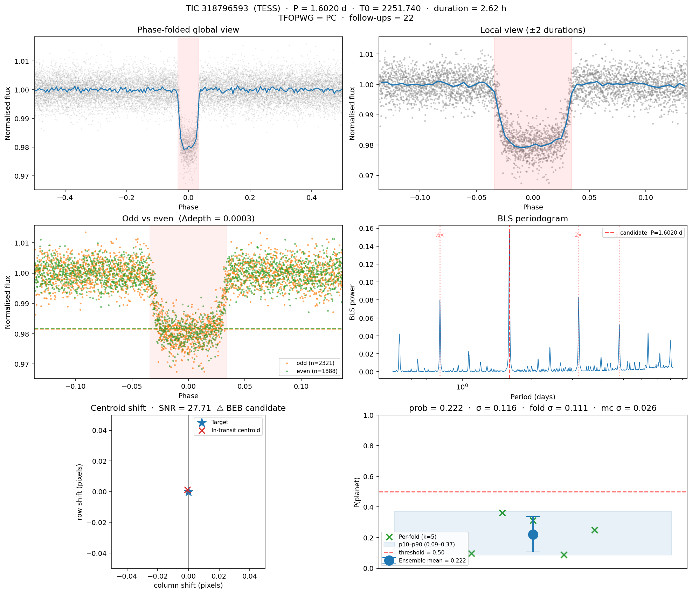
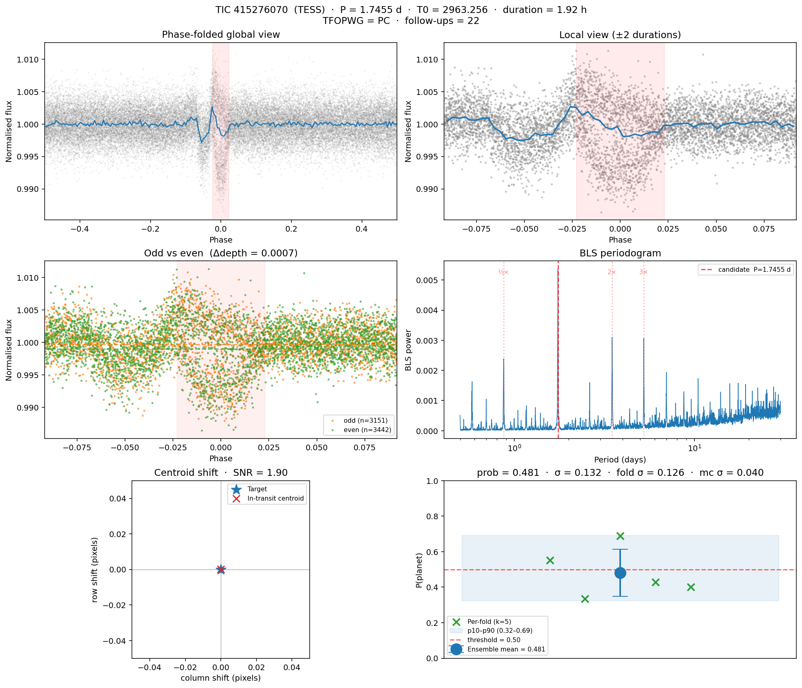

## Author's Note

### The Spark & The Core Question
This project was born in the Wellington library one afternoon when I noticed a glaring gap in my portfolio. While I had a solid foundation in software engineering, I lacked a definitive project that bridged my technical skillset with my deep interest in data science and astronomy. I didn't want to build a cookie-cutter tutorial project; I wanted to tackle something genuinely ambitious that grappled with real, un-sanitised scientific data. I wanted to apply the skills I had learned in my university courses to a project of my own designed to solve a problem that truly mattered to me. I wanted to build something that could, in principle, contribute to the discovery of new worlds beyond our solar system. After all, we pursue ambitious scientific discoveries **not because they are easy, but because they are hard**.

I set out to answer two fundamental questions: **"Can a deep-learning model trained on real NASA TESS and Kepler data actually identify exoplanet transits, and what would it take to build one?"**

---

### The Engineering Pivot: Scope vs. Tractability

My original "dream goal" was a pipeline that would run blind transit searches on arbitrary, random TESS targets — survey the sky myself, find entirely new planetary signals from scratch, and submit my own Community TOIs. As I dug into the astrophysics and the data reality, three engineering constraints fundamentally reshaped that ambition.

**1. The Labelling Constraint.** Supervised deep learning needs labels. A 1D CNN cannot learn what a planetary transit looks like — the symmetric U-shape, the depth proportional to $(R_p/R_*)^2$, the ingress/egress structure — without a clean catalogue of confirmed positives and documented negatives to train against. The only sources of those labels are NASA Exoplanet Archive's *6,278 confirmed exoplanets* (positive examples) and the TOI / KOI disposition tables flagging *tens of thousands of documented false positives* across both missions: eclipsing binaries, instrumental glitches, stellar variability, background blends. Tey et al. 2023's Astronet-Triage-v2 training set alone, drawn from one mission, contains *19,329 junk-labelled TCEs* out of 24,926 total[^tey2023]. After group-stratifying by host star to prevent multi-planet leakage and filtering for usable signal quality, that pool collapses to a few thousand usable training rows — 3,275 in this project's final dataset. You *must* start by learning the planet-vs-FP boundary on this labelled set before you can responsibly apply any model to unreviewed signals. Discovery is therefore a downstream *application* of a classifier, not a starting point you can train directly toward.

**2. The Compute and Data Bottleneck.** A genuine from-scratch discovery pipeline needs to run a Box Least Squares (BLS) search over the raw light curves of stars that are *not yet* candidates. The scale of that task is hard to appreciate until you actually measure it:

| Resource | Quantity |
|:---|---:|
| TESS FFI light curves down to T = 16 mag, **Cycle 1 alone** | **83.7 million** (Roth et al. 2026[^roth2026]) |
| Cadences per star per sector | ~20,000 (2-min cadence) or ~1,400 (30-min FFI) |
| Raw FITS download per target | 5–80 MB depending on sector coverage |
| Blind BLS sweep per star, laptop CPU | 5–10 minutes |
| Sequential BLS over Cycle 1 alone | 83.7 × 10⁶ × 7 min ≈ **1,100 years on a single MacBook** |

For comparison, the most recent published from-scratch survey, Lafarga et al. 2026's RAVEN pipeline[^lafarga2026] , ran BLS on a curated 2.26 million FGK main-sequence subsample on a GPU cluster. It returned 5,664,552 candidate signals after low-S/N cuts (SDE ≤ 7, MES ≤ 0.8), which were filtered through machine-learning vetting down to 2,170 vetted candidates and a total validated sample of 143 planets — of which 118 are newly validated by their pipeline (87 previously-known TOIs/CTOIs they statistically confirmed plus 31 entirely new detections). That is the realistic yield for a survey-scale, cluster-backed effort: planet-finding is a needle-in-a-haystack problem where roughly 99.997 % of the signals BLS surfaces are eclipsing binaries, harmonics, or instrumental systematics (143 / 5.66 M ≈ 2.5 × 10⁻⁵). Genuine discovery also requires **independent confirmation** — radial-velocity follow-up on Magellan, Keck, or HARPS; transit-timing measurements; high-resolution speckle imaging to rule out blended companions. None of those are achievable from a personal laptop, even if the BLS step somehow ran.

**3. The Real-World Bottleneck Is Vetting, Not Detection.** Once I understood the survey landscape, the framing inverted. As of May 2026, TESS alone has produced *7,931 TOIs*, of which only *~885 have been confirmed*[^nea2026]. Roughly *7,000 candidates* sit unreviewed in a queue that already exceeds human vetting capacity. The TOI Follow-up Observing Program (TFOPWG) is gated by reviewer time, not by signal supply. The bottleneck is not "find more anomalies" — it is "sort the anomalies we already have, and tell us which deserve scarce telescope time." That mismatch is exactly what a calibrated machine-learning model is built for: a binary classifier with reliable probability outputs and uncertainty estimates can rank the backlog, surface the highest-confidence un-vetted targets for prioritised follow-up, and demote obvious false positives — freeing reviewer attention for the borderline cases that genuinely need a human eye.

**The Pivot.** For these three reasons — labels are a hard prerequisite, blind BLS at survey scale is compute-infeasible on a laptop, and the field's high-value problem is sorting candidates rather than detecting more — I dropped the "blind survey + submit my own CTOIs" path and re-scoped the project to **calibrated candidate ranking**. The pipeline now ingests noisy, raw TESS and Kepler light curves; cleans, flattens, and phase-folds them; runs the dual-view CNN with 5-fold ensemble and MC-Dropout uncertainty; and returns a probability, an uncertainty estimate, and a six-panel vetting figure per target — exactly the output an over-stretched TFOPWG reviewer needs to prioritise their next follow-up. The BLS infrastructure still lives in `src/exoplanet_hunter/search/`; it simply does not drive the discovery loop. If a future iteration wants to attempt the original blind-survey ambition at smaller scale — say 1,000 hand-picked stars overnight, accepting the low yield — the machinery is in place to do it.

---

### The Development Environment & AI Collaboration
I built the project in VS Code, using **Anthropic's Claude (Opus 4.6/4.7, via the Claude Code CLI)** as an in-terminal pair-programming and tutoring collaborator.

The architecture of this project was deliberately learning-first. My objective was to stretch my university-acquired data science knowledge to build a large-scale system independently, using Claude as an intellectual sounding board and scaffolding tool. Because I am a data science student, not an astronomer or astrophysics expert, I initially relied on LLM guidance to navigate the specialised landscape of astronomical libraries, domain-specific data formats, and essential infrastructure. From that starting point, I took rigorous ownership of the pipeline: verifying every design choice, diving into scholarly articles and peer-reviewed papers, and refining the system through continuous, independent research.

| **What I Brought** | **What Claude Drafted (Under My Direction)** |
|:---|:---|
| **Architecture & Domain Vision:** choice of problem, target datasets (TESS + Kepler via MAST), labels (NASA Exoplanet Archive), and the dual-view CNN family inspired by *Shallue & Vanderburg*[^sv2018]. | **Initial Codebase Scaffolding** — structured skeleton for Hydra config management, MLflow tracking, the dual-view CNN, RF baseline, and preprocessing modules. |
| **Literature & Reference Framework:** curated all source material: machine-learning literature (Marsland[^marsland2014], Géron[^geron2019]) and domain papers (Szabó et al.[^szabo2020]; Islam[^islam2026]; Xie et al.[^xie2025]). | **Targeted Stability Patches** — gradient clipping, impute-and-scale aux pipeline, persisted calibrator/scaler bundle, cross-script aux-dimensionality sync — all on the `fix/training-stability` branch. |
| **Design Judgment Calls:** branch scoping, when to retrain, internal-SSD vs external-USB storage allocation, prioritising data scaling over architecture upgrades (and vice versa). | **Contextual Writeups:** initial explanations linking design choices to references: Géron's Wide-and-Deep pattern → aux path; Szabó's argument against horizontal-flip augmentation; ExoNet's per-KOI dedup vs the per-TIC group split adopted here. |
| **Execution & Quality Control:** every dataset build, every training run, every git commit on my own machine; pushed back on verbose comments, questioned sample sizes before long retrains, caught dead config knobs. | |
| **Report Synthesis:** framing the narrative, choosing what to acknowledge as a limitation, deciding which insights to emphasise. | |

#### What We Worked Out Together:
* **Codebase & Pipeline Audits:** Investigating critical failure modes, such as diagnosing a `loss = NaN` error down to unscaled inputs interacting poorly with the Adam optimiser, and refactoring data structures to prevent information leakage.
* **Roadmap Iteration:** Managing the five-branch sequence, which included folding the separate "training stability" and "data scaling" tracks into a single overnight build once local disk space was optimised.
* **Paper Deconstruction:** Breaking down new reference papers, where Claude summarised dense technical methodology and I determined which mathematical or physical components were valuable enough to integrate.

---

### Engineering Mastery Gained by Friction
True learning happens when textbook concepts clash with raw data friction. By transitioning this project from an abstract dream to a functional pipeline on my local machine, I advanced my practical data science skill set across several critical frontiers:

* **Robust Validation:** Moving beyond simple row-stratified data splits to implement `StratifiedGroupKFold` architectures, guaranteeing that multi-planet systems (grouped by `tic_id`) never leaked across the train/test boundary to inflate performance metrics.
* **Probability Calibration:** Overcoming raw neural network overconfidence by engineering Isotonic Regression and Temperature Scaling pipelines to output mathematically trustworthy prediction probabilities.
* **Production-Grade MLOps:** Transitioning from loose scripts to automated, reproducible experimentation using Hydra for clean configuration composition and MLflow for tracking parameters, metrics, and artefacts.
* **Domain Physics Integration:** Moving past tabular datasets to understand the actual physical phenomena such as gravity darkening, transit-duration variations, and third-light contamination that distinguish raw stellar signals from sterile textbook examples.

The vision, technical execution, judgment, and final synthesis are entirely mine. Claude served as the ultimate terminal-bound collaborator—providing a highly technical sounding board that accelerated development without abstraction.

---

## Abstract

I present an end-to-end deep-learning pipeline for detecting transiting exoplanets in NASA TESS and Kepler light curves. The system downloads stitched SPOC/Kepler light curves directly from MAST via `lightkurve`, builds the dual-view (global + local) phase-folded representation of Shallue & Vanderburg[^sv2018], and feeds it through a 1D convolutional neural network with Squeeze-and-Excitation channel attention[^hu2018] (as applied by Xie et al.[^xie2025]), bilateral multi-head attention plus residual late-fusion[^islam2026], and a Wide-and-Deep auxiliary path carrying 9 stellar/transit/centroid-shift features. Training is 5-fold stratified group k-fold cross-validation grouped by host star to prevent multi-planet leakage; calibration is post-hoc temperature scaling[^guo2017] fitted per fold on validation logits. A baseline Random Forest on hand-crafted features provides a classical-ML reference. Across 5-fold CV on 3,275 TESS+Kepler targets the final branch-3 model achieves ROC-AUC = 0.9555 ± 0.0044, PR-AUC = 0.9586 ± 0.0058, F1 = 0.888 ± 0.012, Brier = 0.0905 ± 0.0130, with temperature T* = 1.28 ± 0.25 — at parity with Islam[^islam2026]'s ExoNet (ROC-AUC 0.955) on a comparable dataset. The largest single contributions are the SE + MHA + residual fusion block (+0.040 ROC over the CV baseline) and a log1p-transformed centroid-shift feature for background-eclipsing-binary discrimination after Ansdell et al.[^ansdell2018] (+0.022 ROC and Brier −0.022 over the raw-centroid step). The full pipeline is reproducible via Hydra + MLflow, and all code is open source.

---

## Introduction

As of 30 April 2026, the NASA Exoplanet Archive[^nea2026] lists 6,278 confirmed exoplanets, of which 4,640 (73.9 %) were discovered by the transit method. NASA's *Transiting Exoplanet Survey Satellite* (TESS), operating since April 2018, has catalogued 7,931 project candidates; the 23 April 2026 data release added 114 new TESS planets in a single update, bringing TESS-confirmed totals to 885. The remaining ~7,000 unreviewed candidates constitute a structural backlog that is beyond the capacity of manual expert vetting and motivates an automated, calibrated, and reproducible machine-learning vetting pipeline. Kepler, TESS's predecessor, with the deeper, narrower-field photometry that produced the highest-quality vetting labels available, contributes 2,784 confirmed planets that this project uses as supplementary training data. Cui et al.[^cui2026] place this work in demographic context: their RAVEN-vetted TESS-SPOC FGK sample gives an overall close-in (0.5–16 d, 2–20 R⊕) planet occurrence rate of 9.4 ± 0.7 %, with hot Jupiters at 0.39 ± 0.03 % and the Neptunian desert at 0.08 ± 0.01 % — anchoring the population our 6,200 held-out PCs are drawn from.

This project was heavily inspired by my DATA 305 class and one of our core textbooks, Marsland[^marsland2014], grounded in the deep-learning tooling covered in Géron[^geron2019] — Keras Functional API, callbacks, Wide-and-Deep architectures, MLflow experiment tracking — and the regression diagnostics taught in DATA 303 (which informed the calibration and uncertainty-quantification components). The technical objective is to build, from real data only (no synthetic light curves in the final training set), a pipeline that can:

1. **Classify** brightness dips in unreviewed targets as *transits* vs *false positives*;
2. **Calibrate** its predicted probabilities so they reflect true likelihoods, suitable for downstream candidate prioritisation;
3. **Generalise** beyond the symmetric textbook transit, on which most published models are trained, to handle the gravity-darkened, spin-orbit-misaligned, and time-variant transit shapes that occur in practice;
4. **Be reproducible**, with every experiment tracked, every hyperparameter version-controlled, and every dataset rebuildable from the catalogue queries.

The architectural baseline is Shallue & Vanderburg[^sv2018]'s "AstroNet" — a dual-view 1D CNN that ingests a low-resolution global phase fold and a high-resolution local zoom of the transit window. Subsequent work has extended this baseline with stellar-context features, transfer learning across missions, and richer multi-branch encodings. Two 2025–2026 papers in particular shape the upgrade path adopted here: Xie et al.[^xie2025] demonstrated that channel-attention (Squeeze-and-Excitation) blocks plus a residual fully-connected head substantially improve training stability and accuracy; Islam[^islam2026] introduced trimodal late fusion with multi-head attention over the CNN feature map, achieving ROC-AUC = 0.955 on Kepler. The present work adopts these as the planned architecture for branch 3 of the project.

A separate physical-realism concern is raised by Szabó et al.[^szabo2020], whose combined analysis of Kepler and TESS observations of Kepler-13Ab — a hot Jupiter orbiting a rapidly rotating, gravity-darkened A-type star — demonstrates that real transits can be substantially asymmetric, can exhibit transit-duration variation (TDV) due to orbital precession (db/dt = −0.011 yr⁻¹), and require third-light correction when contaminated by a binary companion (Shporer et al.[^shporer2014], as applied by Szabó et al.[^szabo2020]). Models trained exclusively on perfectly U-shaped transits will systematically under-detect such cases. Branch 3 addresses the related eclipsing-binary contamination problem directly, by adding a centroid-shift feature (after Ansdell et al.[^ansdell2018]) that flags background blends; injecting hard-example asymmetric transits as labelled positives and adding the planet-radius and stellar-metallicity features that ExoNet uses are retained as future work (see Discussion).

---

## Methodology

### Data sources

All training data is real, no synthetic light curves are used in the final training set. Three public sources, all queried free of charge:

| Source | Used for | Volume |
|:---|:---|---:|
| **MAST archive** (TESS SPOC, Kepler) | Stitched light curves | 14 GB TESS + 38 GB Kepler (on external SSD) |
| **NASA Exoplanet Archive TAP** | Confirmed planets (`ps`), TOI dispositions (`toi`), KOI dispositions (`cumulative`) | ~700 KB labels parquet |
| **TIC v8 / Gaia DR3** (via `astroquery`) | Stellar parameters for TESS targets | per-target lookup |

### Catalogue construction

The labelled catalogue is built deterministically from three TAP queries (`src/exoplanet_hunter/data/catalog.py`). Disposition strings from each archive table are mapped to integer labels:

| Source | Disposition | Label |
|:---|:---|---:|
| TOI / `ps` | `CP`, `KP`, confirmed | 1 (positive) |
| TOI | `FP`, `FA` | 0 (negative) |
| TOI | `PC` | −1 (held out for inference) |
| KOI | `CONFIRMED` | 1 |
| KOI | `FALSE POSITIVE` | 0 |
| KOI | `CANDIDATE` | −1 |

Per-row units are normalised at query time to ensure consistency: `pl_tranmid` is converted from full BJD to BTJD (subtracting 2,457,000.0), TOI `pl_trandurh` is divided by 24 to match the days convention used elsewhere, and KOI `koi_depth` (parts per million) is divided by 10⁶ to match the fractional-depth convention. These conversions were retrofits after a sign of the times: a half-day error in t₀ accumulates to many days of phase error over ~10⁵ orbital cycles, producing all-NaN folded views. Held-out `CANDIDATE` / `PC` rows are persisted separately to `data/labels/candidates.parquet` and never seen during training; they are the inference set used to identify novel signals.

An earlier version of the catalogue included a "QUIET" class — random TIC IDs phase-folded at a *synthesised* period — intended as a no-signal anchor. This was retired (commit `fix/training-stability`): folding a flat baseline at an arbitrary period produces an arbitrary view that the model cannot meaningfully generalise from, and TOI/KOI false positives provide adequate negative examples without the artefact.

### Preprocessing

Each downloaded light curve is processed by a deterministic three-stage
pipeline (`src/exoplanet_hunter/preprocess/`):

1. **Clean** (`clean_lightcurve`): remove NaN cadences and apply a *one-sided* upper sigma clip at 5 σ. The default lightkurve two-sided clip would treat deep transit dips as negative outliers and delete them, so the lower bound is left at +∞.
2. **Flatten** (`flatten_lightcurve`): a Savitzky-Golay filter of window 301 cadences (≈ 10 hours at 2-minute cadence) is fit to the out-of-transit baseline and divided out. *In-transit cadences are masked out of the fit* using the known ephemeris from the catalogue row, otherwise the spline learns to interpolate through the transit and erases the very signal we want to preserve. This is the classic "filter learns the transit" failure mode.
3. **Fold and bin** (`build_views`): the cleaned, flattened light curve is phase-folded at the catalogue period and binned into a *global view* (2,001 bins spanning the full phase) and a *local view* (201 bins spanning ±3 transit durations around phase 0). Each view is median-subtracted and divided by its absolute minimum so that the baseline is at 0 and the deepest dip is at −1; this lets the model see *transit shape*, not *transit magnitude*.

The output is a single compressed numpy archive (`data/processed/views.npz`) containing `global_views`, `local_views`, `labels`, `tic_ids`, and a 9-dimensional `aux_features` vector per target: [$T_{\text{eff}}$, $R_{*}$, $\log g$, $T_{\text{mag}}$, depth, duration, $\log P$, SNR, `centroid_snr`]. The centroid-shift feature (added in branch 3) is the magnitude of the in-transit photocentre offset in units of σ, after detrending the raw `MOM_CENTR1/2` columns for Kepler quarterly rolls and per-segment drift; genuine on-target transits give values < ~3, background eclipsing binaries give values ≥ ~3[^ansdell2018]. Implementation in `src/exoplanet_hunter/features/centroid.py`.

### Model architecture

The principal model is a dual-view 1D CNN (`src/exoplanet_hunter/models/cnn_dualview.py`) implemented in the Keras Functional API. The architecture is Shallue & Vanderburg[^sv2018] extended with attention and residual fusion in branch 3:

- **Global tower:** 3 convolutional blocks (16, 32, 64 filters), 2 conv layers per block with kernel 5, BatchNorm, ReLU, MaxPool size 5, optional SpatialDropout.
- **Local tower:** 2 convolutional blocks (16, 32 filters), 2 conv layers per block with kernel 5, MaxPool size 3.
- **Channel attention (branch 3):** Squeeze-and-Excitation block after each conv block, before MaxPool — GAP → FC(C/r) → ReLU → FC(C) → Sigmoid → channel-wise scale (Hu et al.[^hu2018]; placement per Xie et al.[^xie2025], Fig. 1). Re-weights the convolutional channels by global context.
- **Temporal attention (branch 3):** Multi-Head Attention with residual + LayerNorm at the end of each conv tower, applied to the `(B, T, C)` feature map before GlobalAveragePooling, applied bilaterally to global and local towers (ExoNet, Islam[^islam2026], §III.D).
- **Wide path (auxiliary):** the 9-d standardised stellar/transit/centroid feature vector is concatenated *directly* with the two pooled tower embeddings (the Wide-and-Deep pattern from Géron[^geron2019] Ch. 10). Concretely, the fusion-head input is `[global_GAP ⊕ local_GAP ⊕ aux_vector]` (`⊕` = vector concatenation): the two CNN tower embeddings come first and the aux vector last, with no cross-tower attention or summation between them.
- **Residual fusion head (branch 3):** two fully-connected layers (256, 128 units) with **LeakyReLU(α=0.1, Xie et al.[^xie2025] §2.2)** + BatchNorm + Dropout (p = 0.4), wrapped in a linear residual shortcut from the concatenated embeddings to the head's last layer dimension (ExoNet, Islam[^islam2026], §III.D). The shortcut prevents gradient stagnation in the fusion path before the encoders converge. Dropout is left enabled at inference time (`training=True`) so MC-Dropout uncertainty estimation is available downstream[^gal2016].

A baseline Random Forest classifier on hand-crafted features (depth, duration, depth-SNR, ingress slope, secondary-eclipse depth, odd/even depth ratio) provides the classical-ML reference, with k-fold CV and SHAP feature-importance plots for interpretability.

### Training

Training runs are launched via Hydra (`scripts/train_model.py`); all hyperparameters live in composable YAML configs under `conf/`. Per-run experiment tracking, including resolved configs, learning curves, evaluation plots, and model artefacts, is logged to MLflow.

- **Split:** 5-fold stratified group k-fold cross-validation with `sklearn.model_selection.StratifiedGroupKFold` (group = `tic_id`, stratify on label). Within each outer fold an inner 88/12 `GroupShuffleSplit` separates training from validation; the inner validation drives EarlyStopping, the F1-optimal decision threshold sweep, and the temperature-scaling fit. Multi-planet systems and re-observed TICs are kept entirely within a single fold; without this, test AUC is inflated by 2–5 points through "seen this star before" leakage. The earlier single 70/15/15 split (used through branch 2) is retained in the comparison table for historical context — the move to k-fold is a *correctness* fix, not a tuning lever.
- **Optimiser:** Adam, learning rate 5×10⁻⁴, **with `clipnorm = 1.0` to cap gradient norms**. This was added after multiple earlier runs collapsed to `loss = NaN` mid-training, traced to unscaled stellar-parameter inputs ($T_{\text{eff}} \approx 5{,}800$ vs $\log P \approx 1$) producing exploding gradients in the dense head.
- **Aux feature pipeline:** raw aux features are passed through a `sklearn.Pipeline([SimpleImputer(strategy="median"), StandardScaler])`, fitted on the training split only and reused (not refit) at val/test/inference. The fitted pipeline is persisted alongside the model checkpoint so `score_target.py` reproduces the exact training-time preprocessing.
- **Loss:** binary cross-entropy by default; binary focal loss (γ = 2, α = 0.75) optionally available for stronger negative-class downweighting. When focal loss is active, `class_weight` is disabled to prevent double-counting.
- **Augmentation:** small Gaussian noise (σ = 5×10⁻⁴), small phase shifts (±0.5 %), random depth scaling (±5 %), and 2 % random bin masking. *Time-flip augmentation was removed* on the basis of Szabó et al.[^szabo2020]: real transits are not symmetric, and flipping them mislabels asymmetric ingress/egress shapes.
- **Callbacks:** `EarlyStopping` on `val_auc` (patience 25, restore best), `ModelCheckpoint` on `val_auc`, `ReduceLROnPlateau` on `val_loss` (factor 0.5, patience 8). All standard from the DATA 305 / Géron[^geron2019] Ch. 11 toolbox.
- **Calibration:** post-hoc temperature scaling (Guo et al.[^guo2017]; ExoNet[^islam2026]) — a single scalar T > 0 fitted on validation logits by negative-log-likelihood minimisation, applied at inference as `sigmoid(logit / T)`. Rank-preserving: ROC-AUC and PR-AUC are identical pre- and post-calibration, but Brier and reliability improve. T > 1 indicates the model was overconfident; T < 1 the opposite. (Branch 2 used `sklearn.isotonic.IsotonicRegression` instead; it is functionally equivalent on accuracy but introduces ~3 dozen learnable knots per fold against temperature's one, so generalises slightly worse out of sample. The bundle interface — `calibrator.predict(scores)` — is unchanged, so `score_target.py` works against either.) Decision threshold selected by sweeping ∈ \[0.05, 0.95\] on the validation set and choosing the value that maximises F1.

### Tooling

| Tool | Purpose |
|---|---|
| **Hydra** | Composable YAML configs (`model=`, `data=`, `train=` swappable from CLI) |
| **MLflow** | Experiment tracking — every hyperparameter, metric, plot, and model artefact |
| **Optuna** | Bayesian hyperparameter search with median pruning (scaffolded via `make tune` + `conf/train/tune.yaml`; not exercised for the branch-3 headline numbers) |
| **`lightkurve`** | MAST querying, downloading, and stitching |
| **`astroquery`** | TIC v8 / Gaia DR3 stellar-parameter lookups |
| **Ruff + mypy + pytest** | Pre-commit linting, type checking, synthetic-fixture unit tests |

---

## Results & Discussion

### Branch-3 final performance (5-fold group-stratified CV)

5-fold `StratifiedGroupKFold` (group = `tic_id`) on 3,275 TESS+Kepler targets, MLflow run [`58570d85`](http://127.0.0.1:5050/#/experiments/732906991717652602/runs/58570d85f1dd4f68a7e888988c88eeab):

| Metric | Mean ± std (across folds) |
|:---|---:|
| ROC-AUC | 0.9555 ± 0.0044 |
| PR-AUC | 0.9586 ± 0.0058 |
| F1 (at fold-best threshold) | 0.888 ± 0.012 |
| Brier (calibrated) | 0.0905 ± 0.0130 |
| Temperature T* | 1.275 ± 0.250 |

**Full MLflow per-fold breakdown** (from `mlruns/…/58570d85/artifacts/cv_summary.txt`):

| Fold | ROC-AUC | PR-AUC | F1 | Brier | τ\* (F1-optimal) | T\* (temp) |
|:---|---:|---:|---:|---:|---:|---:|
| 0 | 0.9488 | 0.9527 | 0.882 | 0.1058 | 0.21 | 1.091 |
| 1 | 0.9525 | 0.9523 | 0.872 | 0.1065 | 0.09 | 1.708 |
| 2 | 0.9595 | 0.9653 | 0.887 | 0.0768 | 0.23 | 1.219 |
| 3 | 0.9609 | 0.9654 | 0.907 | 0.0794 | 0.37 | 0.991 |
| 4 | 0.9555 | 0.9572 | 0.893 | 0.0839 | 0.44 | 1.366 |
| **mean** | **0.9555** | **0.9586** | **0.888** | **0.0905** | — | **1.275** |
| std | 0.0044 | 0.0058 | 0.012 | 0.0130 | — | 0.250 |

Every fold clears 0.948 ROC-AUC. The temperature `T*` varies by fold (0.991 – 1.708) because each fold's validation logits land at slightly different overall confidence — a feature of fitting calibration per fold rather than globally, which keeps the calibration honest to the data the fold actually saw.

**Ladder of incremental gains.** Each row below is an additive change with no other modifications; same 3,275-row 5-fold CV split throughout. T* is reported only for folds where temperature scaling is active.

| Variant | ROC-AUC | Brier | T* |
|:---|---:|---:|---:|
| Branch 2 milestone (single 70/15/15 split + isotonic) | 0.901 (test) | 0.092 (test) | n/a |
| Branch 3 step 1 (move to 5-fold group CV) | 0.8836 ± 0.0348 | 0.1396 ± 0.0208 | n/a |
| + SE channel attention + bilateral MHA + residual fusion | 0.9232 ± 0.0098 | 0.1112 ± 0.0096 | n/a |
| + temperature scaling (replaces isotonic) | 0.9295 ± 0.0097 | 0.1118 ± 0.0109 | 1.317 ± 0.115 |
| + `centroid_snr` aux feature (raw, scaled by StandardScaler) | 0.9337 ± 0.0186 | 0.1121 ± 0.0190 | 1.340 ± 0.249 |
| **+ log1p on `centroid_snr` before scaling** | **0.9555 ± 0.0044** | **0.0905 ± 0.0130** | **1.275 ± 0.250** |

The drop from the branch-2 0.901 (test) to the row-1 0.8836 (CV mean) is the *correctness* effect of moving from a single train/val/test cut to k-fold — the single-split test value was an inflated cut, not a real performance loss. The remaining four rows are real gains on the corrected baseline: +0.072 ROC and a ~8× tightening of the fold std (0.0348 → 0.0044). The largest single discrimination gain is the SE + MHA + residual fusion block (+0.040 ROC); the largest single calibration gain is `log1p(centroid_snr)` (Brier −0.022, fold std halved). The raw-scaled centroid step (row 5) is a deliberate ablation showing that the feature's heavy-tailed FP distribution (q90 = 423 vs planet body ~1.1) corrupts `StandardScaler` unless the tail is compressed first.

Earlier runs in the project showed the training-stability failure mode this project explicitly addressed: one `cnn-large` run terminated at epoch 25 with `loss = NaN`, AUC = 0.5 (chance-level). Diagnostic investigation traced this to the combination of (i) un-scaled raw stellar parameters being concatenated into the dense head, (ii) no gradient clipping on the Adam optimiser, and (iii) a pathological interaction with focal loss when `class_weight` was also active. All three were mitigated in branch 1 (`fix/training-stability`).

### Attention diagnostics: what the model attends to

Because the SE + MHA + residual-fusion block is the single largest discrimination gain (+0.040 ROC), it is worth asking what that block actually learns rather than treating it as a black box. The multi-head attention layers are re-run at inference with `return_attention_scores=True` and the Squeeze-and-Excitation excitation gates are tapped directly, producing one diagnostic figure per candidate (`scripts/render_attention.py`, fold-0 model). Each figure pairs the phase-folded flux with the attention received per phase bin (top and middle rows), the head-mean `(query, key)` attention matrices (right column), and the per-block SE channel gates (bottom row).

The robust, repeatable result is in the **global tower**: across short-, medium-, and long-period candidates the global multi-head attention localises onto the transit phase. The head-mean matrix shows a bright vertical band at the key-phase bin containing the transit — i.e. every query position attends preferentially to the transit, regardless of where it sits in phase — and the attention-received curve spikes at phase 0 above an otherwise flat baseline. This is the clearest interpretability evidence that the temporal-attention block keys on the physically meaningful part of the signal rather than on out-of-transit noise. The pattern is identical for the 703-day TOI-4328.01, confirming it is not an artefact of any particular orbital period:

{width=48%}
{width=48%}

*Attention diagnostics — global temporal-attention localisation. **Left:** TIC 468983280 (P = 3.15 d): the global tower's multi-head attention concentrates sharply on the transit phase, while the local tower and SE gates remain diffuse. **Right:** TIC 77175217 / TOI-4328.01 (P = 703.8 d): the same localisation holds at long period.*

Two honest null results temper the interpretation. First, the **local tower** — the high-resolution zoom on the transit window where ingress/egress live — does *not* preferentially attend to the transit: the in-window attention-received concentration is ≈0.97–1.00× the baseline, i.e. effectively flat. The transit localisation is a global-view phenomenon, and it is on the transit *centre*, not specifically on the ingress/egress limbs. Second, the **SE channel gates** sit near a mean of ≈0.50 for every block with only modest per-channel spread, so there is no evidence here of strong, systematic channel suppression; without a learned channel-to-frequency mapping it would also be unjustified to label any down-weighted channel as a "stellar-noise" channel. The discrimination gain from the block is therefore attributable principally to the global temporal-attention localisation documented above, with the SE gates and local-tower attention contributing more diffusely. These figures are rendered from a single CV fold rather than the 5-fold scoring ensemble, so they are a qualitative interpretability aid rather than an ensemble-exact attribution.

### Comparison with published baselines

| Study | Year | Mission | Sample | Architecture | Reported metric |
|:---|---:|:---|---:|:---|:---|
| Shallue & Vanderburg | 2018 | Kepler DR24 | 15,737 | Dual-view 1D CNN ("AstroNet") | 98% accuracy |
| Ansdell et al. | 2018 | Kepler | ~16,000 | AstroNet + scalar aux features | Improved over baseline |
| Dattilo et al.[^dattilo2019] | 2019 | K2 | — | AstroNet (transferred) | Two new planets confirmed |
| Yu et al. | 2019 | TESS (simulated) | — | AstroNet + stellar depth | Recall 61% on real TESS (degraded) |
| Valizadegan et al. (ExoMiner) | 2022 | Kepler | — | Multi-branch CNN | 301 new exoplanets validated |
| Tey et al. (Astronet-Triage-v2) | 2023 | TESS QLP FFI | 24,926 | Dual-view 1D CNN, 5-label, 3-vetter consensus | PR-AUC = 0.965 (test); 89% precision / 91% recall on unseen S33 |
| Valizadegan et al. (ExoMiner++)[^valiz2025] | 2025 | TESS 2-min | — | Transfer learning from Kepler | 7,330 TESS candidates |
| Martinho et al. (ExoMiner++ 2.0 FFI) | 2026 | TESS FFI | 6,419 FFI TCEs | CV-ensemble (5 folds) + difference-image branch | PR-AUC = 0.952 (FFI), 0.967 (2-min) |
| Xie et al. (SE-CNN-RlNet) | 2025 | Kepler + TESS | ~7,000 | AstroNet + SE channel attention + residual MLP | F1 = 0.957 (Kepler), 0.995 (TESS) |
| Islam (ExoNet) | 2026 | Train: Kepler / Inference: TESS PCs | 7,585 train / 4,720 inference | AstroNet + 8-head MHA + residual late fusion + temperature scaling | Test ROC-AUC = 0.9549 |
| Lafarga et al. (RAVEN) | 2026 | TESS-SPOC FFI (S1–55, FGK) | 2.26 M stars / 14,815 NSFP-cut | GBDT + GP ensemble per-FP scenario, synthetic PASTIS training | 118 validated, 31 newly detected; posterior > 0.99 across 8 FP scenarios |
| **This work — branch 2** | 2026 | TESS only | 1,959 | AstroNet + Wide&Deep + isotonic | ROC-AUC = 0.901 (test, single split) |
| **This work — branch 3** | 2026 | TESS + Kepler | 3,275 | + SE + bilateral MHA + residual fusion + temperature scaling + log1p centroid | **ROC-AUC = 0.9555 ± 0.0044 (5-fold CV)** |

After branch 3, the model is at parity with Islam[^islam2026]'s ExoNet on ROC-AUC (0.9555 vs 0.9549) on a comparable Kepler+TESS dataset, with a 5-fold CV evaluation that is stricter than ExoNet's single 70/15/15 train/val/test split. The remaining gap to Xie et al.[^xie2025]'s SE-CNN-RlNet (F1 = 0.957 Kepler, 0.995 TESS) is driven primarily by the sample-size difference (3,275 vs ~7,000 examples) and the per-mission split — the SE-CNN architectural ideas from that paper are already adopted here. Branch 4 (candidate discovery) will exercise the model on the 6,200 held-out TOI/Kepler Planet Candidates retained from the catalogue build.

The comparison entries from Tey et al.[^tey2023], Martinho et al.[^martinho2026], and Lafarga et al.[^lafarga2026] report PR-AUC rather than ROC-AUC and operate on different sample compositions (FFI-only or TESS-SPOC-FFI-only), so headline numbers should not be compared digit-for-digit with ours. They are included as reference points for the broader vetting-pipeline landscape. The RAVEN pipeline (Hadjigeorghiou et al.[^hadji2025]; Lafarga et al.[^lafarga2026]) is the most methodologically distinct of these — a GBDT + Gaussian-Process ensemble trained on PASTIS-injected synthetic light curves, classifying each candidate against eight specific astrophysical FP scenarios separately. Its >0.97 ROC-AUC on simulated test data is not directly comparable to our 0.9555 on real TFOPWG-labelled holdout — the simulated-vs-real evaluation distinction matters more than the architectural one — but the per-scenario decomposition is a credible future direction for this project's binary classifier.

### Branch-4 candidate-discovery results

The branch-3 5-fold ensemble was applied to all 6,200 held-out Planet Candidates in `data/labels/candidates.parquet` (4,570 TESS + 1,630 Kepler). Each candidate was scored by all five fold-models, with 30 MC-Dropout samples per fold and per-fold temperature scaling, yielding `prob_mean ± prob_std` plus a fold-disagreement metric. The full run completed at 86.9 % coverage: **5,388 / 6,200 candidates received a valid probability score** — TESS 3,895 / 4,570 = 85.2 % ok, Kepler 1,493 / 1,630 = 91.6 % ok. The remaining 812 split between permanent catalogue gaps (652 TESS `no SPOC pipeline data` plus the small Kepler-side equivalent) and 160 preprocessing failures where the catalogue period/epoch does not yield a usable phase-fold across both missions. A subset of the initial Kepler run failed against a transient MAST CAOMv240 backend outage during scoring; those candidates were recovered by adding a direct-archive HTTP download path (`archive.stsci.edu/pub/kepler/lightcurves/{KIC[:4]}/{KIC:09d}/`) to the light-curve downloader, which bypasses the CAOM search layer entirely. The fallback is now the primary Kepler download path in `src/exoplanet_hunter/data/download.py`, with the existing `lightkurve.search_lightcurve` retained as a safety fallback for anything the direct archive cannot serve.

**The deliverable: a calibrated priority list of unconfirmed candidates.** Branch 4's output is a ranked priority list — 6,200 unconfirmed Planet Candidates ordered by ensemble probability, each row carrying an MC-Dropout standard deviation, p10/p90 quantiles, between-fold disagreement, and within-fold dropout disagreement. The discovery score `prob_mean × (1 − fold_disagree) × 1/(1 + n_followup/3)` further upweights candidates that are *both* high-confidence *and* under-investigated by the community, on the principle that telescope time is more productively spent on a strong candidate nobody has followed up than on a marginal candidate already well-vetted. The decision-relevant evidence for the trustworthiness of this ranking is the Branch-3 cross-validation reported in the previous section — ROC-AUC = 0.9555 ± 0.0044, PR-AUC = 0.9586 ± 0.0058, Brier = 0.0905, fold-std contraction from 0.0348 → 0.0044 across the ablation ladder. PR-AUC integrates over every operating point, so the discriminative claim does not depend on a single chosen threshold; the Brier score speaks to whether `prob_mean = 0.95` actually corresponds to a ~95 % chance. The since-confirmed recall analysis below is a downstream sanity check on a different population, not the headline metric for this work.

**High-confidence still-unconfirmed picks.** Across the 5,388 successfully scored PCs, **146 received `prob_mean ≥ 0.95`** and remain unconfirmed in the live ExoFOP TFOPWG snapshot (2026-05-22) — 140 TESS and 6 Kepler. TOI-4328.01 (TIC 77175217, P = 703.79 d, prob = 0.989, `fold_disagree` = 0.006) is the single highest-probability unconfirmed candidate in the entire pool. The three highest-ranked **long-period** (P > 500 d) candidates — the regime of primary follow-up interest — are TOI-4328.01, TOI-4565.01 (TIC 381897917, P = 692.52 d, prob = 0.983), and TOI-4353.01 (TIC 176797879, P = 718.18 d, prob = 0.980); ranked by raw probability among the still-unconfirmed candidates these sit 1st, 6th and 11th respectively, the intervening entries being shorter-period TESS objects. Long-period TESS detections are scientifically valuable because TESS's sector-by-sector observing pattern makes them rare and ground-based follow-up campaigns are lengthy. Inspection of the rendered vetting figures reveals a consistent pattern across these long-period picks: shallow transits (~600–1800 ppm) where the BLS periodogram shows no dominant peak at the candidate period, but where odd/even depth differences are essentially zero (Δdepth ≤ 0.0002) and centroid shifts are well below the BEB-warning threshold (SNR ≤ 2.0). For TOI-4328.01 specifically, the single-transit nature at P = 703.8 d means BLS lacks the statistical power to flag the candidate at all over the TESS baseline — only a learned dual-view model can recover such a signal. These are precisely the candidates where the trained CNN adds value over classical BLS-only pipelines, which would deprioritise the same targets for lack of strong periodogram support.

The six new Kepler picks at `prob_mean ≥ 0.95` are all KOIs: KOI-3444.01 (KIC 5384713, P = 12.67 d, prob = 0.971), KOI-3034.01 (KIC 2973386, P = 31.02 d, prob = 0.969), KOI-6925.01 (KIC 7868967, P = 12.95 d, prob = 0.962), KOI-6276.01 (KIC 2557350, P = 3.10 d, prob = 0.957), KOI-6568.01 (KIC 5353938, P = 6.28 d, prob = 0.956), and KOI-8012.01 (KIC 10452252, P = 34.57 d, prob = 0.951). All six are still listed as `CANDIDATE` in the latest Kepler KOI cumulative table and were recovered by the direct-archive download path described above.

{width=72%}

*Six-panel vetting view of the top pick TOI-4328.01 (TIC 77175217). Top row: phase-folded global view, phase-folded local view (zoomed on the transit), odd / even depth overlay. Bottom row: BLS periodogram with harmonics marked, centroid-shift diagram, ensemble probability with MC-Dropout standard-deviation band and per-fold dots. The combination of a clean shallow transit (~600 ppm), zero odd / even depth difference, a centroid SNR well below the BEB-warning threshold, and tight per-fold agreement (`fold_disagree = 0.006`) is what drives the `prob_mean = 0.989` score. The BLS periodogram lacks a dominant peak at the candidate period — exactly the regime where a learned dual-view model adds value over classical periodogram-only pipelines.*

Two complementary rankings are produced downstream of these scores. Sorting by raw `prob_mean` surfaces the candidates with the strongest learned signal regardless of community attention; TOI-4328.01 heads that list overall, with the remaining high-probability entries a mix of short- and long-period TESS candidates (the long-period subset is highlighted separately above for its follow-up value). The `discovery_score = prob_mean × (1 − fold_disagree) × 1/(1 + n_followup/3)` re-rank multiplicatively penalises high-follow-up candidates so that already-vetted TOIs sink and under-investigated targets surface; the top of that list is dominated by the six Kepler KOIs, which carry no `n_followup` value in the ExoFOP TFOPWG schema (TFOPWG follow-up tracking is a TESS-side construct) and therefore default to a full 1× multiplier. The asymmetry between the two missions in this score is an honest limitation of the simple formula and is noted as future work; the rest of this report reports top picks by `prob_mean`. Six-panel vetting figures for the top-20 have been rendered to `results/vetting/`; they constitute the prioritised list for manual review against ExoFOP TFOP files and any subsequent community follow-up. They remain candidates, not discoveries, until and unless independently confirmed.

**Internal sanity check: recall on since-confirmed planets.** A 2026-05-18 snapshot of the NASA Exoplanet Archive Planetary Systems table was cross-referenced against the 6,200 held-out PCs by joining on TOI base ID and requiring orbital period agreement within 2 %. This identified **120 candidates that were labelled `PC` at training-catalogue build time but have since been promoted to confirmed-planet status by other surveys / follow-up programs**. These planets were never seen by the model during training but are known to be real. They are not discoveries by this work — the confirmations were performed elsewhere — but they serve as a real-world generalisation check on a population the model never trained on:

| Threshold | Recall | 95 % CI (Wilson) |
|---:|:---|:---|
| 0.3 | 99.2 % (119/120) | [95.4, 99.9] |
| **0.5** | **95.8 % (115/120)** | **[90.6, 98.2]** |
| 0.7 | 80.8 % (97/120) | [72.9, 86.9] |
| 0.9 | 30.8 % (37/120) | [23.3, 39.6] |
| 0.95 | 11.7 % (14/120) | [7.1, 18.6] |
| 0.99 | 0.0 % (0/120) | [0.0, 3.1] |

The mean `prob_mean` across the 120 confirmed planets is 0.80, consistent with well-calibrated probabilities for a positive-but-noisy class. The sharp drop above threshold 0.9 is the expected behaviour of post-hoc temperature scaling (T* = 1.275) — the calibration step deliberately compresses the right tail to correct the pre-calibration softmax's overconfidence, rather than indicating model failure. recall@0.99 = 0 % is therefore correct, not pathological. The 95.8 % at threshold 0.5 is a sanity check that the model generalises to real planets confirmed after training closed; it is not a benchmark claim against the published systems (see methodological note below for why), and it is not the metric on which the priority list above stands or falls.

**Failure-mode analysis: the five planets the model scored below 0.5.** Vetting-figure inspection (`results/vetting/`) shows that the five "misses" fall into three distinct categories, none of which represent random model failure:

*Category 1 — model correctly suspicious of likely background-EB signature (2 of 5).* TOI-2886 b (P = 1.60 d, prob = 0.222) and TOI-3474 b (P = 3.88 d, prob = 0.396) both exhibit deep V-shaped transits combined with extreme centroid shifts (in-transit centroid SNR = 27.7 and 16.6 respectively, far above the 3.0 BEB-warning threshold). The dual-view CNN and the centroid feature jointly downweight these, which is the scientifically correct response to the available photometric data — the centroid shift indicates the dip is most likely leaking from a fainter source within the aperture, not from the TIC target. The planets' subsequent confirmations almost certainly relied on independent radial-velocity or high-resolution imaging that resolved the photometric ambiguity.

{width=68%}

*Category-1 example. TOI-2886 b (TIC 318796593): the local-view panel shows a deep V-shaped transit, the centroid-shift panel reports an in-transit offset of 27.7σ (vs the 3σ BEB threshold), and the ensemble probability lands at 0.222 with a wide MC-Dropout band — the model is honestly uncertain because the photometric evidence genuinely looks more like a background eclipsing binary than an on-target planet. The candidate was later confirmed via independent follow-up that the photometry alone cannot replicate.*

*Category 2 — wide-binary dilution (1 of 5).* TOI-3523 A b (P = 2.30 d, prob = 0.417). The "A" suffix marks this as the bright component of a known wide binary; the companion star contaminates the photometric aperture and produces a centroid SNR of 5.2, just above the BEB threshold. As with category 1, the model is correctly suspicious of what its inputs show; the resolution requires non-photometric vetting.

*Category 3 — genuine borderline / edge-of-distribution (2 of 5).* TOI-1291 b (P = 7.16 d, prob = 0.464) is shallow (~800 ppm) with a mild centroid concern (SNR = 4.3). TOI-4773 b (P = 1.75 d, prob = 0.481) shows an asymmetric dip-then-bump morphology in its phase fold, consistent with starspot crossings or grazing geometry — exactly the kind of asymmetric transit (cf. Kepler-13Ab, Szabó et al.[^szabo2020]) flagged in the limitations section as a known training-data gap. Both express honest model uncertainty: ensemble σ values of 0.112 and 0.132 are 15–20× larger than the top-picks σ (~0.007), indicating "I don't know" rather than confident rejection.

{width=68%}

*Category-3 example. TOI-4773 b (TIC 415276070): the global and local views show an asymmetric dip-then-bump shape inconsistent with the symmetric U-shape the model learned to recognise. The centroid SNR is fine (1.9, below the BEB threshold) so the model can't reject on EB grounds, but the morphology is far enough from the training-set distribution that the prediction sits at 0.481 with ensemble σ = 0.132 — a textbook "I don't know" output rather than a confident rejection. Injecting Kepler-13Ab-style asymmetric transits as labelled positives (see Discussion) is the proposed fix.*

The first two categories — three of five — are arguably correct decisions on the photometric evidence available; the model is performing the EB-rejection it was trained to perform, and the catalogue's confirmation status relies on non-photometric vetting that the model cannot see. The third category exposes the only systematic training-data gap: very shallow signals and asymmetric / spot-crossed transits are under-represented in the labelled positives. This motivates the future-work item of injecting Kepler-13Ab-like asymmetric transits and starspot-crossing examples as labelled positives (see Discussion below).

**Methodological note on cross-study recall comparison.** **Our recall figure must be read differently from every published number in the table below, because it is measured on a fundamentally different — and more recently updated — dataset.** This work evaluates recall on a freshly pulled NASA Exoplanet Archive snapshot, scoring the **120 candidates that were confirmed *after* our training catalogue closed**: a forward-in-time population the model provably never saw, taken from a registry that has been updated since the comparison studies were published. None of those studies do this — their recall is an *in-sample* figure measured on labels held out from the very dataset they trained on, so the two numbers answer different questions and cannot be ranked head-to-head. Shallue & Vanderburg[^sv2018], Yu et al.[^yu2019], Valizadegan et al. (2022, ExoMiner)[^valiz2022], and Islam (2026, ExoNet)[^islam2026] all report recall on a random ~10 % held-out split of the same labelled dataset they trained on (typically Kepler DR24/DR25 autovetter or TESS QLP TFOPWG labels). Each work picks a different operating point — the precision constraints alone span 0.45 → 0.90 → 0.99 — so the headline recall numbers are not commensurable digit-for-digit:

| Work | Dataset | Split | Reported recall | At what operating point |
|:---|:---|:---|---:|:---|
| AstroNet (Shallue & Vanderburg 2018) | Kepler DR24 autovetter, 15,737 TCEs | random 80/10/10 (test = 1,523) | 0.95 | at precision = 0.90 |
| ExoMiner (Valizadegan et al. 2022) | Kepler DR25, 30,957 TCEs (2,643 CP + 28,314 FP) | held-out test set | 0.936 | at precision = 0.99 (very strict) |
| Yu et al. 2019 (Astronet-Vetting TESS) | TESS S1–5 QLP, 16,516 TCEs (test = 1,650) | random 80/10/10 | ~0.90 (44/49 PCs) | at threshold = 0.1, precision = 0.45 |
| **This work — Branch 4** | 6,200 held-out PCs | **temporal holdout** (PC → confirmed after training-catalogue build) | **0.958** | at threshold = 0.5, no precision constraint |

Those works test "of the labels held out from training, how many are correctly classified at the chosen operating point?" — a within-distribution generalisation check. This work's recall number tests "of the candidates that flipped to confirmed real planets between training-catalogue build and the snapshot date, how many would the model have flagged at the un-tuned decision boundary?" — a temporal real-world generalisation check on a different population. Precision is not computable on the 120 because the set contains no negatives by construction, so this work cannot quote a precision-recall operating point analogous to AstroNet's or ExoMiner's. The right place to compare discriminative ability across studies is the headline ROC-AUC and PR-AUC reported in the previous section, where this work matches Islam (2026, ExoNet)[^islam2026] at 0.9555 vs 0.9549 on a methodologically similar TESS+Kepler dataset, using a stricter 5-fold per-star group CV with substantially less training data (3,275 examples vs ExoNet's 7,585, AstroNet's 15,737, or ExoMiner's 30,957). The priority list is the deliverable; the CV metrics back its calibration; the 95.8 % since-confirmed recall is one downstream piece of evidence that the ranking surfaces real planets, not the headline.

### Discussion of limitations and future work

**Sample size and class imbalance.** The branch-3 3,275-example training set is competitive with the ~3,500–7,000 regime of recent published work[^xie2025][^islam2026] but does not approach the ~16,000-example regime of the original AstroNet. The set is mildly positive-leaning — 1,733 confirmed planets and 1,542 negatives (52.9 % positive prevalence) — so the random-classifier PR-AUC baseline is ≈ 0.529 against which the reported PR-AUC = 0.9586 ± 0.0058 is a +0.43 absolute lift. ExoNet's per-KOI (rather than per-star) deduplication strategy is an avenue worth exploring: it preserves multi-planet systems as distinct samples (e.g. Kepler-90's eight confirmed planets each contribute) at the cost of relaxing the strict per-star group split adopted here. Adopting it would likely add ~1,500 effective examples.

**Asymmetric and time-variant transits.** Szabó et al.[^szabo2020] document Kepler-13Ab as a textbook counter-example to the symmetric U-shaped transit assumption. Gravity darkening on the rapidly rotating host star produces an asymmetric ingress/egress; spin-orbit misalignment of 58.6° (Johnson et al.[^johnson2014], as adopted by Szabó et al.[^szabo2020]) tilts the transit chord; orbital precession driven by stellar oblateness causes a measurable transit-duration variation across years. A model trained only on symmetric transits — exactly the failure mode of an architecture with horizontal-flip augmentation enabled, which this project removed in `fix/training-stability` — will systematically miss such systems. Injecting Kepler-13Ab and a broader set of grazing / starspot-crossing transits as labelled positives, using `batman` (Kreidberg[^batman2015]) for symmetric limb-darkened shapes and `ellc` (Maxted[^ellc2016]) for the asymmetric, gravity-darkened, and spot-crossing profiles, is planned as **Branch-5+ future work**, on the principle that the model should be trained on the full range of signals it will be expected to find.

**Detrending.** The current Savitzky-Golay flattening is robust but blunt. Szabó et al.[^szabo2020] detrended their Kepler-13Ab data with WOTAN's iterative biweight method (Hippke et al.[^hippke2019], AJ), specifically chosen for its robustness to instrumental scatter and noise instability. A controlled A/B comparison between Savitzky-Golay and WOTAN biweight — using identical splits and an otherwise-identical pipeline, with the lower validation Brier score determining the default — is deferred to **Branch-5+ future work**. The losing method will be retained as a documented "tried, didn't help" alternative for full traceability.

**Architectural upgrades shipped in branch 3.** Squeeze-and-Excitation channel attention (Hu et al.[^hu2018]; placement per Xie et al.[^xie2025]), bilateral multi-head attention plus LayerNorm-residual[^islam2026], LeakyReLU in the head (Xie et al.[^xie2025] §2.2), a residual late-fusion linear shortcut from the concatenated embeddings to the head's last layer[^islam2026], and post-hoc temperature scaling[^guo2017] all landed on `feat/architecture-upgrades`. Together they account for +0.046 ROC over the CV baseline (0.8836 → 0.9295).

**Physical features.** The current 9-d aux vector adds `centroid_snr` (branch 3) to the eight branch-2 features. ExoNet's 8-d vector also includes planet radius ($R_p$), equilibrium temperature ($T_{\text{eq}}$), and metallicity ($[\text{Fe/H}]$); extending the aux dimension to 12 with these is straightforward (the pipeline auto-handles arbitrary aux dimensionality) and is a candidate for a follow-on branch.

**Eclipsing-binary discrimination.** Branch 3 added one BEB-discrimination angle — the centroid-shift feature, after Ansdell et al.[^ansdell2018] — which contributed +0.026 ROC and Brier −0.021 once the log1p transform was applied. Two further cheap features derivable directly from the existing global view remain on the roadmap: *odd/even transit depth ratio* (catches eclipsing binaries with primary/secondary depth differences) and *secondary-eclipse depth at phase 0.5* (catches grazing EBs and self-luminous companions).

**Third-light correction.** Szabó et al.[^szabo2020] apply third-light ratios for Kepler-13A (l₃ = 0.91 Kepler, 0.934 TESS, originally derived by Shporer et al.[^shporer2014]) and discuss the systematic underestimation of planet radius that occurs when contamination is ignored. This project does not currently regress $R_p / R_*$, only classifies, so third-light correction is out of scope; it is documented as a known limitation should the work be extended to radius regression.

**Independent cross-check against the RAVEN catalogue (Branch-5+ future work).** The Branch-4 high-confidence picks were cross-referenced against the live ExoFOP TFOPWG and NEA PS registries. A further independent check would compare our top-K targets against the RAVEN catalogue of Lafarga et al.[^lafarga2026] — specifically their ~1,000 vetted TESS-SPOC FFI candidates that are not yet TOI or CTOI — to quantify agreement and surface divergences where the two pipelines' methodological differences (CNN photometric vetting vs. GBDT + GP per-scenario validation) produce different verdicts. The intended strategy is a two-stage analysis: first a targeted overlap check on our top-50 high-confidence picks to identify immediate community follow-up candidates, then a systematic efficiency sweep across the full RAVEN non-TOI sample to map where our model's recall falls off (likely long-period or grazing signals that favour RAVEN's injection-trained FP scenarios). The RAVEN catalogue is not in `data/external/` at the time of writing. Once ingested, the cross-match can be run reproducibly through the project's existing Hydra + MLflow pipeline.

**Uncertainty-quantification alternatives.** This project uses MC-Dropout[^gal2016] with n=30 samples for per-candidate epistemic uncertainty, combined with the 5-fold ensemble disagreement signal. Yoon & Kim[^yoonkim2025] introduce *flexible evidential deep learning* (F-EDL), which predicts a Flexible Dirichlet distribution over class probabilities and yields closed-form aleatoric and epistemic uncertainty from a **single forward pass**, with empirical generalisation across noisy and long-tailed settings exceeding standard EDL. For a follow-on branch, F-EDL would cut bulk-scoring inference time by roughly the MC-sample count (~30×) while providing a theoretically better-calibrated decomposition than dropout-based UQ.

**Discovery-score mission asymmetry.** The current `discovery_score = prob_mean × (1 − fold_disagree) × 1/(1 + n_followup/3)` formula penalises high-follow-up candidates so that under-investigated targets surface to the top of the list. Because community follow-up counts in the ExoFOP TFOPWG schema are a TESS-side construct, Kepler KOIs carry no `n_followup` value and default to the full 1× multiplier — which gives them an unintended advantage in the rerank relative to TESS candidates of comparable raw `prob_mean`. A Kepler-side analogue of follow-up tracking (e.g. the count of papers citing a KOI in the NASA ADS) would symmetrise the score. Until that is wired in, the report leads with the raw `prob_mean` ranking and treats the discovery-score view as a secondary lens on the same data.

---

## Glossary of key terms

All key terms used in this report, defined in context. Section references point to where each term is introduced or used most substantively.

```{=latex}
\begin{multicols}{2}
\footnotesize
```

### A

**Adam (optimiser)** — An adaptive gradient-descent optimisation algorithm combining momentum and per-parameter RMS gradient scaling. Used with `clipnorm = 1.0` to prevent exploding gradients during training. See *Training*.

**Aleatoric uncertainty** — Irreducible randomness inherent to the data itself (e.g. photon noise, instrumental scatter). Distinguished from epistemic uncertainty. See *Discussion — Uncertainty-quantification alternatives*.

**Asymmetric transit** — A transit light curve whose ingress and egress slopes differ, caused by gravity darkening, spin-orbit misalignment, or starspot crossings. The failure mode of horizontal-flip augmentation and the motivation for the branch-3 training-data gap fix. See *Introduction*, *Discussion*.

**astroquery** — Python library used to query the TIC v8 and Gaia DR3 catalogues for per-target stellar parameters. See *Methodology — Data sources*.

**AstroNet** — The dual-view 1D CNN architecture introduced by Shallue & Vanderburg (2018); the architectural baseline for this project. See *Introduction*, *Methodology — Model architecture*.

**AUC** — Area Under the Curve; a summary statistic for an ROC or PR curve. See **ROC-AUC** and **PR-AUC**.

---

### B

**Background eclipsing binary (BEB)** — A stellar binary within the photometric aperture of a target that produces transit-like flux dips originating from a fainter background source rather than the TIC target. Flagged by a centroid-shift SNR ≥ ~3. See *Methodology — Preprocessing*, *Branch-4 results — Failure-mode analysis*.

**batman** — Python library (Kreidberg 2015) for computing synthetic transit light curves (BAsic Transit Model cAlculatioN); planned for asymmetric-transit injection in follow-on work. See *Discussion — Asymmetric and time-variant transits*.

**BatchNorm (Batch Normalisation)** — A neural network layer that normalises its input across the mini-batch to stabilise training and accelerate convergence. Used in all convolutional blocks and the fusion head. See *Methodology — Model architecture*.

**Barycentric Julian Date (BJD)** — An astronomically corrected time standard referenced to the Solar System barycentre; the raw time convention in TESS SPOC products before BTJD conversion. See *Methodology — Catalogue construction*.

**Barycentric TESS Julian Date (BTJD)** — BJD − 2,457,000.0; the time convention used by the TESS SPOC pipeline and adopted internally in this project. See *Methodology — Catalogue construction*.

**Box Least Squares (BLS)** — A classical periodogram algorithm that searches for periodic box-shaped dips in a light curve; the standard transit-detection method before machine learning. Discussed as lacking sensitivity to single-transit signals (e.g. TOI-4328.01). See *Branch-4 results — High-confidence picks*.

**Brier score** — A proper scoring rule for probabilistic forecasts equal to the mean squared error between predicted probability and the binary label; lower is better (0 = perfect). Measures calibration quality independently of threshold choice. See *Results — Branch-3 performance*, *Methodology — Training*.

---

### C

**Centroid shift** — The magnitude of the in-transit photocentre offset in units of σ, computed from the `MOM_CENTR1/2` Kepler columns and the TESS equivalent after detrending for quarterly rolls and per-segment drift. Genuine on-target transits give centroid SNR < ~3; background eclipsing binaries give ≥ ~3 (Ansdell et al. 2018). Added as the ninth auxiliary feature in branch 3. See *Methodology — Preprocessing*, *Results — Ladder of gains*.

**Channel attention** — See **Squeeze-and-Excitation (SE) block**.

**clipnorm** — The gradient-norm clipping threshold passed to the Adam optimiser (`clipnorm = 1.0`); caps gradient norms to prevent training collapse to `loss = NaN`. See *Methodology — Training*, *Results — Discussion*.

**Confirmed planet (CP / KP)** — A TOI or KOI disposition indicating that a planet candidate has been independently verified (e.g. by radial velocity, transit-timing variations, or statistical validation) and given an official designation. Maps to label 1 in the training catalogue. See *Methodology — Catalogue construction*.

**Cross-entropy (binary)** — The default loss function for binary classification; measures the KL divergence between the predicted probability and the one-hot label. See *Methodology — Training*.

**CTOI (Community TESS Object of Interest)** — A planet candidate flagged by community members rather than the official TFOPWG pipeline; referenced as a comparison population in the Discussion. See *Discussion — Independent cross-check against the RAVEN catalogue*.

---

### D

**Decision threshold (τ)** — The probability cutoff above which a prediction is classified as a planet. Selected per fold by sweeping τ ∈ [0.05, 0.95] on the validation set and choosing the value maximising F1. See *Methodology — Training*.

**Discovery score** — A composite ranking metric `prob_mean × (1 − fold_disagree) × 1/(1 + n_followup/3)` that up-weights high-confidence candidates with few community follow-up observations. See *Branch-4 results*.

**Dropout** — A regularisation technique that randomly zeros activations during training; left enabled at inference time (`training=True`) to support MC-Dropout uncertainty estimation. See *Methodology — Model architecture*, *Training*.

**Dual-view CNN** — A 1D convolutional neural network with two parallel input towers: a global view (full phase fold, 2,001 bins) and a local view (transit window, 201 bins). The core architecture of this project, following AstroNet. See *Methodology — Model architecture*.

---

### E

**EarlyStopping** — A Keras training callback that halts training when a monitored metric (here `val_auc`, patience 25) stops improving and restores the best checkpoint. See *Methodology — Training*.

**Eclipsing binary (EB)** — A binary star system where one component periodically transits the other as seen from Earth, producing flux dips that can mimic a planet transit. Identified by odd/even depth differences, secondary eclipses, and centroid shifts. See *Introduction*, *Methodology*.

**ellc** — Python library (Maxted 2016) for computing light curves of eclipsing binaries with gravity darkening and spot-crossing profiles; planned for asymmetric-transit injection. See *Discussion — Asymmetric and time-variant transits*.

**Ephemeris** — The set of orbital parameters defining a transit's timing: orbital period P, reference mid-transit time t₀, and transit duration. Used to mask in-transit cadences during detrending and to construct phase folds. See *Methodology — Preprocessing*.

**Epistemic uncertainty** — Model uncertainty arising from limited or unrepresentative training data; in principle reducible with more data. Estimated here via MC-Dropout variance and between-fold disagreement. See *Branch-4 results*, *Discussion — Uncertainty-quantification alternatives*.

**ExoFOP (Exoplanet Follow-up Observing Program)** — The community database (part of NExScI) tracking TESS candidate follow-up observations and TFOPWG dispositions; used to cross-reference high-confidence picks and count community follow-up for the discovery score. See *Branch-4 results*.

**ExoMiner / ExoMiner++** — Multi-branch CNN vetting pipelines from Valizadegan et al. (2022, 2025) that validated 301 new Kepler planets and 7,330 TESS candidates respectively; compared in the baseline table. See *Results — Comparison with published baselines*.

**ExoNet** — The trimodal deep-learning vetting pipeline from Islam (2026) using bilateral multi-head attention and temperature scaling on Kepler+TESS data; ROC-AUC = 0.9549, used as the primary benchmark. See *Introduction*, *Results — Comparison*.

---

### F

**F1 score** — The harmonic mean of precision and recall; the metric used to select the decision threshold per fold. See *Results — Branch-3 performance*, *Methodology — Training*.

**False alarm (FA)** — A TOI disposition indicating that a transit-like signal is an instrumental or statistical artefact (not a real astrophysical event). Maps to label 0. See *Methodology — Catalogue construction*.

**False positive (FP)** — A transit-like signal from a real astrophysical source (e.g. eclipsing binary) that is not a planet. Maps to label 0. See *Methodology — Catalogue construction*.

**Flatten (light curve)** — Dividing a light curve by a smooth polynomial or filter fit to the out-of-transit baseline to remove stellar variability and instrumental trends. Implemented here using a Savitzky-Golay filter with in-transit masking. See *Methodology — Preprocessing*.

**Focal loss** — A modified binary cross-entropy that down-weights easy negatives to focus training on hard-to-classify examples (Lin et al.[^lin2017]; γ = 2, α = 0.75). Optionally available; when active, `class_weight` is disabled to prevent double-counting. See *Methodology — Training*.

**Fold disagreement** — The standard deviation of `prob_mean` predictions across the 5-fold ensemble; low values indicate consistent, high-confidence predictions. Used in the discovery score. See *Branch-4 results*.

---

### G

**Gaia DR3** — The third data release of the ESA Gaia astrometry mission; queried via astroquery to supplement TIC v8 stellar parameters. See *Methodology — Data sources*.

**Global Average Pooling (GAP)** — A pooling operation that averages all temporal positions in a feature map to produce a fixed-length embedding vector; applied at the end of each CNN tower after the MHA block. See *Methodology — Model architecture*.

**Global view** — The 2,001-bin phase-folded representation of the full orbital phase, providing a low-resolution overview of the transit and any secondary eclipses. One of the two inputs to the dual-view CNN. See *Methodology — Preprocessing*, *Model architecture*.

**Gradient clipping** — Rescaling gradient vectors to a maximum norm (here 1.0) before the optimiser step; prevents training instability caused by exploding gradients. See *Methodology — Training*, **clipnorm**.

**Gravity darkening** — A physical effect on rapidly rotating stars in which the equatorial region is cooler and less luminous than the poles; produces asymmetric transit light curves when the planet's orbit is inclined relative to the stellar equator (as in Kepler-13Ab). See *Introduction*, *Discussion*.

**GroupShuffleSplit** — A scikit-learn cross-validator that partitions data into train and validation while keeping all rows sharing a group key in the same partition; used for the inner 88/12 validation split within each outer fold. See *Methodology — Training*.

---

### H

**Hot Jupiter** — A gas-giant exoplanet (roughly Jupiter mass and radius) with an orbital period typically < 10 days, placing it in a very close-in, irradiated orbit. See *Introduction*.

**Hydra** — A Python framework for composable, hierarchical YAML-based configuration management; all training hyperparameters are versioned in `conf/`. See *Methodology — Tooling*.

---

### I

**Isotonic regression** — A non-parametric post-hoc calibration method using a piecewise-constant monotone function fitted on validation scores; used in branch 2, replaced by temperature scaling in branch 3. See *Methodology — Training*.

---

### K

**Keras Functional API** — The Keras model-construction interface supporting multi-input, multi-output, and shared-layer architectures; used to build the dual-view CNN with auxiliary wide path. See *Methodology — Model architecture*.

**Kepler** — NASA's space-photometry telescope (2009–2018) that monitored ~150,000 stars in a fixed field and discovered ~2,800 confirmed planets; provides high-quality supplementary training data via the MAST archive. See *Introduction*, *Methodology — Data sources*.

**Kepler-13Ab** — A hot Jupiter orbiting a rapidly rotating A-type star; the canonical example of gravity darkening, transit asymmetry, transit-duration variation, and third-light contamination in the literature (Szabó et al. 2020). See *Introduction*, *Discussion*.

**KIC (Kepler Input Catalog)** — The photometric catalogue of stars in the Kepler field; targets are identified by their nine-digit KIC number. See *Branch-4 results*.

**KOI (Kepler Object of Interest)** — A Kepler target exhibiting at least one candidate transit signal; dispositioned as CONFIRMED, FALSE POSITIVE, or CANDIDATE in the NASA Exoplanet Archive cumulative KOI table. See *Methodology — Catalogue construction*, *Branch-4 results*.

---

### L

**LayerNorm (Layer Normalisation)** — A normalisation technique applied per-sample across the feature dimension; applied after each MHA residual connection in the CNN towers. See *Methodology — Model architecture*.

**LeakyReLU** — A variant of the ReLU activation function that permits a small non-zero gradient (α = 0.1) for negative inputs, reducing dead-neuron saturation; used in the residual fusion head per Xie et al. (2025). See *Methodology — Model architecture*.

**Light curve** — A time-series measurement of the flux (brightness) of a star; the primary observational data product in transit photometry, produced by TESS SPOC and the Kepler pipeline. See throughout.

**lightkurve** — Python library for querying, downloading, and stitching TESS SPOC and Kepler light curves from the MAST archive. See *Methodology — Data sources*, *Tooling*.

**Local view** — The 201-bin phase-folded representation of the ±3 transit-duration window around phase 0, providing a high-resolution zoom on the ingress, transit floor, and egress. One of the two inputs to the dual-view CNN. See *Methodology — Preprocessing*, *Model architecture*.

**log1p transform** — The transformation log(1 + x), applied to `centroid_snr` before StandardScaler to compress the heavy right tail of the BEB-dominated distribution; contributed the largest single calibration improvement (Brier −0.022, alongside a +0.022 ROC gain) in the ablation ladder. See *Results — Ladder of gains*.

---

### M

**MAST (Mikulski Archive for Space Telescopes)** — The STScI-hosted archive from which TESS SPOC 2-minute cadence and Kepler long-cadence light curves are downloaded. See *Methodology — Data sources*.

**MaxPool** — A pooling layer that retains the maximum activation in each window; used to downsample feature maps between convolutional blocks (size 5 in the global tower, size 3 in the local tower). See *Methodology — Model architecture*.

**MC-Dropout (Monte Carlo Dropout)** — Inference is run n = 30 times with Dropout enabled; the per-candidate mean and standard deviation of the predictions approximate epistemic uncertainty without retraining. See *Methodology — Model architecture*, *Branch-4 results*.

**MLflow** — Open-source MLOps platform used to log every training run's hyperparameters, metrics, learning curves, evaluation plots, and model artefacts. See *Methodology — Tooling*.

**ModelCheckpoint** — A Keras callback that saves the model weights whenever a monitored metric improves; used to save the best checkpoint on `val_auc`. See *Methodology — Training*.

**Multi-head attention (MHA)** — An attention mechanism (Vaswani et al. 2017) in which multiple attention heads independently learn to weight sequence positions by learned query–key similarity; applied bilaterally (to both towers) after the final convolutional block, following Islam (2026, ExoNet). See *Methodology — Model architecture*, *Results — Attention diagnostics*.

---

### N

**NASA Exoplanet Archive** — The authoritative public catalogue of confirmed exoplanets and candidates, operated by NExScI at IPAC/Caltech; the source of confirmed-planet labels (`ps` table), TOI dispositions, and KOI dispositions queried via TAP. See *Introduction*, *Methodology — Data sources*.

**Neptunian desert** — A sparsely populated region of close-in (period ~2–4 days) Neptune-sized parameter space, likely shaped by photoevaporation; cited as part of the population-demographic context (Cui et al. 2026). See *Introduction*.

---

### O

**Odd/even depth ratio** — The ratio comparing transit depths on alternating (odd-numbered vs. even-numbered) transits; a statistically significant difference indicates an eclipsing binary rather than a planet, because secondary eclipses appear at half-integer phase. See *Branch-4 results*, *Discussion — Eclipsing-binary discrimination*.

**Optuna** — A Bayesian hyperparameter optimisation framework with median pruning; scaffolded via `make tune` and `conf/train/tune.yaml` but not exercised for the branch-3 headline metrics. See *Methodology — Tooling*.

**Orbital precession** — A gradual, secular change in the orientation of an orbit; in Kepler-13Ab driven by stellar oblateness (J₂), leading to measurable transit-duration variation (TDV) at a rate of db/dt = −0.011 yr⁻¹. See *Introduction*, *Discussion*.

---

### P

**Phase fold** — Folding a time-series light curve modulo the orbital period, so that all transits stack coherently at phase 0. The fundamental preprocessing step that converts a sparse time series into the dense input representation used by the CNN. See *Methodology — Preprocessing*.

**Planet Candidate (PC)** — A TOI or KOI disposition indicating a transit-like signal consistent with a genuine exoplanet but not yet independently confirmed; the held-out inference set for branch 4. Maps to label −1 (not used in training). See *Methodology — Catalogue construction*, *Branch-4 results*.

**ppm (parts per million)** — Unit of fractional flux deficit; 1,000 ppm = 0.1 % decrease in stellar brightness. Transit depths in the KOI catalogue are reported in ppm and divided by 10⁶ at ingestion to match the fractional convention. See *Methodology — Catalogue construction*.

**PR-AUC (Precision–Recall AUC)** — The area under the precision–recall curve; the preferred discrimination metric when classes are imbalanced, as it weights false positives more heavily than ROC-AUC. See *Results — Branch-3 performance*.

**Precision** — Of all examples predicted positive, the fraction that are truly positive. See *Results — Comparison with published baselines*.

**Probability calibration** — Post-hoc adjustment of model output scores so that a predicted probability p reflects the true empirical proportion of positives at that score. Implemented here as temperature scaling (branch 3) or isotonic regression (branch 2). See *Methodology — Training*, *Results*.

---

### Q

**QUIET class** — An earlier negative-example type created by phase-folding random TIC targets at synthesised periods; retired in `fix/training-stability` because folding at an arbitrary period produces meaningless views that the model cannot generalise from. See *Methodology — Catalogue construction*.

---

### R

**RAVEN** — A GBDT + Gaussian-Process ensemble vetting pipeline (Lafarga et al. 2026) trained on PASTIS-injected synthetic light curves; classifies each TESS-SPOC FFI candidate against eight independent astrophysical false-positive scenarios. See *Results — Comparison*, *Discussion*.

**Recall** — Of all true positive examples, the fraction that are correctly predicted as positive; reported at several operating points for the since-confirmed planet sanity check. See *Branch-4 results — Internal sanity check*.

**ReduceLROnPlateau** — A Keras callback that reduces the learning rate by a factor (0.5) when `val_loss` plateaus for a set patience (8 epochs); prevents the optimiser from stalling in flat loss regions. See *Methodology — Training*.

**Reliability diagram** — A calibration plot of mean predicted probability (x-axis) vs. observed positive fraction (y-axis) in equal-width probability bins; a perfectly calibrated model lies on the identity line. See *Methodology — Training*.

**Residual connection (shortcut)** — A skip connection that adds the input of a block directly to its output, enabling gradients to flow around a layer and preventing gradient stagnation in the fusion head. A linear projection is used to match dimensions. See *Methodology — Model architecture*.

**ROC-AUC** — Area under the Receiver Operating Characteristic curve, which plots true-positive rate vs. false-positive rate across all decision thresholds; the primary discrimination metric for this project (branch-3 mean 0.9555 ± 0.0044). See *Results — Branch-3 performance*.

---

### S

**Savitzky-Golay filter** — A polynomial convolution smoothing filter; applied with window 301 cadences (≈ 10 hours at 2-minute TESS cadence) to fit the out-of-transit stellar continuum. In-transit cadences are masked from the fit to prevent the "filter learns the transit" failure mode. See *Methodology — Preprocessing*.

**Secondary eclipse** — The brightness decrease as the planet passes behind its host star, occurring at orbital phase ~0.5; its depth and shape can be used to discriminate self-luminous objects and grazing eclipsing binaries. See *Results — Baseline Random Forest*, *Discussion — Eclipsing-binary discrimination*.

**Signal-to-noise ratio (SNR)** — Ratio of transit signal amplitude to the RMS out-of-transit noise; one of the nine auxiliary features fed to the wide path of the network. See *Methodology — Preprocessing*.

**SimpleImputer** — A scikit-learn transformer that replaces missing values with a summary statistic; configured with `strategy="median"` for the auxiliary feature pipeline. See *Methodology — Training*.

**SpatialDropout** — A dropout variant that drops entire feature channels (rather than individual activations), applied optionally in the global convolutional tower. See *Methodology — Model architecture*.

**SPOC (Science Processing Operations Center)** — The NASA/MIT pipeline that processes raw TESS pixel data into calibrated 2-minute cadence light curves (PDC-SAP flux). See *Methodology — Data sources*, *Branch-4 results*.

**Spin-orbit misalignment** — The angle between a planet's orbital angular momentum and the host star's spin axis; 58.6° in Kepler-13Ab (Johnson et al. 2014 via Szabó et al. 2020), causing transit asymmetry. See *Introduction*, *Discussion*.

**Squeeze-and-Excitation (SE) block** — A channel-attention mechanism (Hu et al. 2018) that applies GlobalAveragePooling across time to obtain a channel descriptor, passes it through two FC layers (bottleneck ratio r), and multiplies the resulting gates element-wise onto the feature map, re-weighting channels by global context. Placed after each convolutional block, before MaxPool, per Xie et al. (2025). See *Methodology — Model architecture*, *Results — Attention diagnostics*.

**StandardScaler** — A scikit-learn transformer that standardises each feature to zero mean and unit variance, fitted on the training split only and applied to validation, test, and inference data. See *Methodology — Training*.

**StratifiedGroupKFold** — A scikit-learn cross-validation splitter that simultaneously preserves class-label proportions across folds (stratification) and ensures all rows sharing a group key (`tic_id`) remain in the same fold (group constraint). Prevents multi-planet leakage of 2–5 AUC points. See *Methodology — Training*, *Results*.

---

### T

**TAP (Table Access Protocol)** — The IVOA standard query interface used to pull confirmed-planet, TOI, and KOI catalogue rows from the NASA Exoplanet Archive. See *Methodology — Catalogue construction*.

**Temperature scaling** — A single-parameter post-hoc calibration method (Guo et al. 2017) that divides the model's pre-sigmoid logit by a learned scalar T > 0 before applying the sigmoid; T > 1 compresses overconfident scores, T < 1 expands underconfident ones. Rank-preserving (ROC-AUC unchanged). Branch-3 mean T* = 1.275 ± 0.250. See *Methodology — Training*, *Results*.

**TESS (Transiting Exoplanet Survey Satellite)** — NASA's all-sky photometric survey satellite (2018–present); the primary data source for this project, with 27-day sector observations at 2-minute cadence for selected targets. See throughout.

**TFOPWG (TESS Follow-up Observing Program Working Group)** — The community programme that organises ground-based and space-based follow-up of TESS candidates and maintains the ExoFOP database of candidate dispositions and follow-up reports. See *Methodology — Catalogue construction*, *Branch-4 results*.

**Third-light contamination** — Flux contribution from a companion star or nearby source within the photometric aperture that dilutes the observed transit depth and causes the apparent planet radius to be underestimated. Characterised by the third-light ratio l₃; discussed in the context of Kepler-13Ab (Shporer et al. 2014, Szabó et al. 2020). See *Discussion*.

**TIC (TESS Input Catalog)** — The photometric and astrometric catalogue of stars selected for TESS 2-minute cadence observations; targets are identified by their TIC ID. See throughout.

**TOI (TESS Object of Interest)** — A TESS target flagged by the SPOC pipeline as showing a candidate transit signal; assigned a disposition by the TFOPWG: CP (Confirmed Planet), KP (Known Planet), FP (False Positive), FA (False Alarm), or PC (Planet Candidate). See *Methodology — Catalogue construction*, *Branch-4 results*.

**Transit** — A brief, periodic dimming of a star's light as a planet (or other body) passes in front of the stellar disc; the observational signature detected by TESS and Kepler and classified by the models in this project. See throughout.

**Transit-duration variation (TDV)** — A secular change in transit duration across successive observations, caused by orbital precession changing the transit chord length; measured at db/dt = −0.011 yr⁻¹ in Kepler-13Ab. See *Introduction*, *Discussion*.

**Transit method** — The technique of detecting exoplanets by measuring the periodic fractional flux decrease as a planet transits across the stellar disc; responsible for 73.9 % of all confirmed exoplanet discoveries as of April 2026. See *Introduction*.

---

### U

**Uncertainty quantification (UQ)** — Methods for estimating the confidence or reliability of model predictions, going beyond point estimates. This project uses MC-Dropout (epistemic) combined with fold disagreement. See *Branch-4 results*, *Discussion — Uncertainty-quantification alternatives*.

---

### V

**Views (global / local)** — See **Global view** and **Local view**.

---

### W

**Wide-and-Deep architecture** — A neural network design pattern (Géron 2019, Ch. 10) that concatenates a "wide" direct input path with a "deep" feature-extraction path; applied here by concatenating the raw 9-d auxiliary feature vector directly with the two CNN tower GAP embeddings before the fusion head. See *Methodology — Model architecture*.

**WOTAN** — Python library for time-series detrending (Hippke et al. 2019) that includes an iterative biweight method chosen for robustness to instrumental scatter; proposed as an alternative to the Savitzky-Golay flattener in a future A/B experiment. See *Discussion — Detrending*.

```{=latex}
\end{multicols}
\normalsize
```

---


## References

Ansdell, M., Ioannou, Y., Osborn, H. P., Sasdelli, M., Smith, J. C., Caldwell, D., Jenkins, J. M., Räissi, C., & Angerhausen, D. (2018). Scientific domain knowledge improves exoplanet transit classification with deep learning. *The Astrophysical Journal Letters*, 869(1), L7.

Christiansen, J. L., McElroy, D. L., Harbut, M., Ciardi, D. R., Crane, M., Good, J., Hardegree-Ullman, K. K., Kesseli, A. Y., Lund, M. B., Lynn, M., Muthiah, A., Nilsson, R., Oluyide, T., Papin, M., Rivera, A., Susemiehl, N., Swain, M., Tam, R., van Eyken, J., & Beichman, C. (2025). The NASA Exoplanet Archive and Exoplanet Follow-up Observing Program: Data, tools, and usage. *arXiv preprint* arXiv:2506.03299.

Cui, K., Armstrong, D. J., Hadjigeorghiou, A., Lafarga, M., Kunovac, V., Doyle, L., Nieto, L. A., & Díaz, R. F. (2026). Demographics of close-in TESS exoplanets orbiting FGK main-sequence stars. *Monthly Notices of the Royal Astronomical Society*, 546(2), 1–16. https://doi.org/10.1093/mnras/stag022

Dattilo, A., Vanderburg, A., Shallue, C. J., Mayo, A. W., Berlind, P., Bieryla, A., Calkins, M. L., Esquerdo, G. A., Everett, M. E., Howell, S. B., Latham, D. W., Scott, N. J., & Yu, L. (2019). Identifying exoplanets with deep learning. II. Two new super-Earths uncovered by a neural network in K2 data. *The Astronomical Journal*, 157(5), 169.

Gal, Y., & Ghahramani, Z. (2016). Dropout as a Bayesian approximation: Representing model uncertainty in deep learning. *Proceedings of the 33rd International Conference on Machine Learning (ICML)*, 1050–1059.

Géron, A. (2019). *Hands-on machine learning with Scikit-Learn, Keras, and TensorFlow* (2nd ed.). O'Reilly Media.

Guo, C., Pleiss, G., Sun, Y., & Weinberger, K. Q. (2017). On calibration of modern neural networks. *Proceedings of the 34th International Conference on Machine Learning (ICML)*, 70, 1321–1330.

Hadjigeorghiou, A., Armstrong, D. J., Cui, K., Lafarga Magro, M., Nieto, L. A., Díaz, R. F., Doyle, L., & Kunovac, V. (2025). RAVEN: RAnking and Validation of ExoplaNets. *arXiv preprint* arXiv:2509.17645 (submitted to *Monthly Notices of the Royal Astronomical Society*).

Hippke, M., David, T. J., Mulders, G. D., & Heller, R. (2019). Wōtan: Comprehensive time-series detrending in Python. *The Astronomical Journal*, 158(4), 143.

Hu, J., Shen, L., & Sun, G. (2018). Squeeze-and-excitation networks. *Proceedings of the IEEE Conference on Computer Vision and Pattern Recognition (CVPR)*, 7132–7141.

Islam, M. R. (2026). ExoNet: Calibrated multimodal deep learning for TESS exoplanet candidate vetting using phase-folded light curves, stellar parameters, and multi-head attention. *arXiv preprint* arXiv:2604.15560v3.

Johnson, M. C., Cochran, W. D., Albrecht, S., Dodson-Robinson, S. E., Winn, J. N., & Gullikson, K. (2014). A misaligned prograde orbit for Kepler-13 Ab via Doppler tomography. *The Astrophysical Journal*, 790(1), 30. https://doi.org/10.1088/0004-637X/790/1/30

Kreidberg, L. (2015). batman: BAsic Transit Model cAlculatioN in Python. *Publications of the Astronomical Society of the Pacific*, 127(957), 1161. https://doi.org/10.1086/683602

Lafarga, M., Armstrong, D. J., Cui, K., Hadjigeorghiou, A., Kunovac, V., Doyle, L., Bryant, E. M., Díaz, R. F., Nieto, L. A., & Osborn, A. (2026). Automatic search for transiting planets in TESS–SPOC FFIs with RAVEN: over 100 newly validated planets and over 2000 vetted candidates. *Monthly Notices of the Royal Astronomical Society*, 548(2), 1–30. https://doi.org/10.1093/mnras/stag512

Lin, T.-Y., Goyal, P., Girshick, R., He, K., & Dollár, P. (2017). Focal loss for dense object detection. *Proceedings of the IEEE International Conference on Computer Vision (ICCV)*, 2980–2988.

Marsland, S. (2014). *Machine learning: An algorithmic perspective* (2nd ed.). Chapman and Hall/CRC.

Maxted, P. F. L. (2016). ellc: A fast, flexible light curve model for detached eclipsing binary stars and transiting exoplanets. *Astronomy & Astrophysics*, 591, A111. https://doi.org/10.1051/0004-6361/201628579

Martinho, M. J. S., Valizadegan, H., Jenkins, J. M., Caldwell, D. A., Twicken, J. D., Tofflemire, B., & Jafariyazani, M. (2026). ExoMiner++ 2.0: Vetting TESS full-frame image transit signals. *arXiv preprint* arXiv:2601.14877. (Submitted to *The Astronomical Journal*.)

NASA Exoplanet Archive. (2026). Exoplanet and candidate statistics, accessed May 2026. https://exoplanetarchive.ipac.caltech.edu/docs/counts_detail.html — see Christiansen et al. (2025) for the canonical service description.

Roth, J. T., Hartman, J. D., Bakos, G. Á., Yee, S. W., Bouma, L. G., Yana Galarza, J., Teske, J. K., Butler, R. P., Crane, J. D., Shectman, S., Osip, D., Vissapragada, S., Kanodia, S., Beletsky, Y., & Gaibor, Y. (2026). The T16 Planet Hunt: 10,000 new planet candidates from TESS Cycle 1 and the confirmation of a hot Jupiter around TIC 183374187. *arXiv preprint* arXiv:2604.18579.

Shallue, C. J., & Vanderburg, A. (2018). Identifying exoplanets with deep learning: A five-planet resonant chain around Kepler-80 and an eighth planet around Kepler-90. *The Astronomical Journal*, 155(2), 94.

Shporer, A., Jenkins, J. M., Rowe, J. F., Sanchis-Ojeda, R., Esquerdo, G. A., Howell, S. B., Bryson, S. T., Twicken, J. D., Buchhave, L. A., & Latham, D. W. (2014). Kepler-13Ab — A binary system, photometric reflection, and a very massive planet. *The Astrophysical Journal*, 788(1), 92. *[Source of the l₃ third-light ratios for Kepler-13A used by Szabó et al. 2020.]*

Szabó, Gy. M., Pribulla, T., Pál, A., Bódi, A., Kiss, L. L., & Derekas, A. (2020). The clockwork is moving on — a combined analysis of TESS and Kepler measurements of Kepler-13Ab. *Monthly Notices of the Royal Astronomical Society Letters*, 492(1), L17–L21. https://doi.org/10.1093/mnrasl/slz177

Tey, E., Moldovan, D., Kunimoto, M., Huang, C. X., Shporer, A., Daylan, T., Muthukrishna, D., Vanderburg, A., Dattilo, A., Ricker, G. R., & Seager, S. (2023). Identifying exoplanets with deep learning. V. Improved light-curve classification for TESS full-frame image observations. *The Astronomical Journal*, 165(3), 95. https://doi.org/10.3847/1538-3881/acad85 *(introduces the Astronet-Triage-v2 network.)*

Valizadegan, H., Martinho, M. J. S., Wilkens, L. S., Jenkins, J. M., Smith, J. C., Caldwell, D. A., Twicken, J. D., Gerum, P. C. L., Walia, N., Hausknecht, K., Lubin, N. Y., Bryson, S. T., & Oza, N. C. (2022). ExoMiner: A highly accurate and explainable deep learning classifier that validates 301 new exoplanets. *The Astrophysical Journal*, 926(2), 120.

Valizadegan, H., Martinho, M. J. S., Jenkins, J. M., Twicken, J. D., Caldwell, D. A., Maynard, P., Wei, H., Zhong, W., Yates, C., Donald, S., Collins, K. A., Latham, D., Barkaoui, K., Calkins, M. L., Chazov, N., Esquerdo, G. A., Guillot, T., Krushinsky, V., Nowak, G., Rackham, B. V., Triaud, A., Schwarz, R. P., Stephens, D., Stockdale, C., Watkins, C. N., & Wilkin, F. P. (2025). ExoMiner++: Enhanced transit classification and a new vetting catalog for 2-minute TESS data. *The Astronomical Journal*, 170(6), 287. https://doi.org/10.3847/1538-3881/ae03a4

Xie, D., Wang, Y., Liu, F., & Sun, W. (2025). Deep learning to classify exoplanet light curves in Kepler and TESS. *Research in Astronomy and Astrophysics*, 25, 104004 (13 pp.). https://doi.org/10.1088/1674-4527/adf70e

Yu, L., Vanderburg, A., Huang, C. X., Shallue, C. J., Crossfield, I. J. M., Gaudi, B. S., Daylan, T., Dattilo, A., Armstrong, D. J., Ricker, G. R., Vanderspek, R. K., Latham, D. W., Seager, S., Dittmann, J., Doty, J. P., Glidden, A., & Quinn, S. N. (2019). Identifying exoplanets with deep learning. III. Automated triage and vetting of TESS candidates. *The Astronomical Journal*, 158(1), 25.

Yoon, T., & Kim, H. (2025). Uncertainty estimation by flexible evidential deep learning. *Advances in Neural Information Processing Systems (NeurIPS)*, 39.

---

## Course materials consulted

Géron, A. (2019). *Hands-on machine learning with Scikit-Learn, Keras, and TensorFlow* (2nd ed.). Provided as `Hands-On_Machine_Learning_with_Scikit-Learn-Keras-and-TensorFlow-2nd-Edition-Aurelien-Geron.pdf`. Reference for: Wide-and-Deep architectures (Ch. 10), Keras Functional API and callbacks (Ch. 10–11), training stability and gradient clipping (Ch. 11), Hydra/MLflow-style experiment infrastructure (Ch. 19), feature scaling and pipelines (Ch. 2).

DATA 303 — Statistical Modelling for Data Science, Weeks 1–6 (Victoria University of Wellington, 2026). Reference for: regression diagnostics applied to calibration assessment (§3), interaction and transformation of predictors as motivation for the aux-feature engineering (§4), and shrinkage methods (§8) as conceptual analogue for the L2 regularisation used in the conv towers.

---

## Project artefacts

- **Codebase:** `/Users/ollie/Project/`, branch `feat/architecture-upgrades` at branch-3 completion; the same content lands on `main` at this milestone.
- **Catalogue:** `data/labels/labels.parquet` (3,500 rows after the May-2026 depth/duration unit fix); `data/labels/candidates.parquet` (6,200 held-out Planet Candidates: 4,570 TESS + 1,630 Kepler, reserved for branch-4 inference).
- **Processed views:** `data/processed/views.npz` — 3,275 examples × 9-dim aux (TESS + Kepler combined, group-stratified). The pre-centroid 8-dim view set is rebuildable from the catalogue for apples-to-apples ablation.
- **Trained models:** `models/cv/<run_id>/fold_{0..4}/cnn_dualview.keras` for each branch-3 step. The branch-3 final run is [`58570d85`](http://127.0.0.1:5050/#/experiments/732906991717652602/runs/58570d85f1dd4f68a7e888988c88eeab). Per-fold calibration bundles at the same paths contain `{calibrator: TemperatureScaler, temperature, threshold, aux_pipeline, aux_dim}`.
- **Experiment history:** `mlruns/732906991717652602/` — covers branch 1 (training stability), branch 2 (data quality + metrics audit), and branch 3 (architecture + centroid). Branch-3 ladder MLflow run ids: step 1 (CV baseline) `71ec8452…`, step 2 (SE+MHA+residual) `1d9ef1e9…`, step 3 (temperature scaling) `4d9485e1…`, step 4A (centroid raw) `cc4ab87b…`, step 4B (centroid + log1p) `58570d85…`.
- **Reference papers consulted:** the Géron textbook (2019); Szabó et al. (2020) on Kepler-13Ab; Islam (2026) ExoNet; Xie et al. (2025) SE-CNN-RlNet; Christiansen et al. (2025) on the NEA + ExoFOP services; the RAVEN trilogy (Hadjigeorghiou et al. 2025; Lafarga et al. 2026; Cui et al. 2026) for the TESS-SPOC FFI vetting and occurrence-rate context; Tey et al. (2023) for Astronet-Triage-v2; Martinho et al. (2026) for ExoMiner++ 2.0 FFI; Yoon & Kim (2025) for the F-EDL uncertainty-quantification framework; and a May-2026 literature review covering centroid-shift diagnostics and the published ExoMiner++ 2-min paper.

<!-- Footnote definitions (citations) -->
[^roth2026]: Roth, J. T., Hartman, J. D., Bakos, G. Á., Yee, S. W., et al. (2026). The T16 Planet Hunt: 10,000 new planet candidates from TESS Cycle 1 and the confirmation of a hot Jupiter around TIC 183374187. *arXiv preprint* arXiv:2604.18579.
[^sv2018]: Shallue, C. J., & Vanderburg, A. (2018). Identifying exoplanets with deep learning: A five-planet resonant chain around Kepler-80 and an eighth planet around Kepler-90. *The Astronomical Journal*, 155(2), 94.
[^marsland2014]: Marsland, S. (2014). *Machine learning: An algorithmic perspective* (2nd ed.). Chapman and Hall/CRC.
[^geron2019]: Géron, A. (2019). *Hands-on machine learning with Scikit-Learn, Keras, and TensorFlow* (2nd ed.). O'Reilly Media.
[^szabo2020]: Szabó, Gy. M., Pribulla, T., Pál, A., et al. (2020). The clockwork is moving on — a combined analysis of TESS and Kepler measurements of Kepler-13Ab. *Monthly Notices of the Royal Astronomical Society Letters*, 492(1), L17–L21.
[^islam2026]: Islam, M. R. (2026). ExoNet: Calibrated multimodal deep learning for TESS exoplanet candidate vetting using phase-folded light curves, stellar parameters, and multi-head attention. *arXiv preprint* arXiv:2604.15560v3.
[^xie2025]: Xie, D., Wang, Y., Liu, F., & Sun, W. (2025). Deep learning to classify exoplanet light curves in Kepler and TESS. *Research in Astronomy and Astrophysics*, 25, 104004.
[^hu2018]: Hu, J., Shen, L., & Sun, G. (2018). Squeeze-and-excitation networks. *Proceedings of the IEEE Conference on Computer Vision and Pattern Recognition (CVPR)*, 7132–7141.
[^guo2017]: Guo, C., Pleiss, G., Sun, Y., & Weinberger, K. Q. (2017). On calibration of modern neural networks. *Proceedings of the 34th International Conference on Machine Learning (ICML)*, 70, 1321–1330.
[^ansdell2018]: Ansdell, M., Ioannou, Y., Osborn, H. P., et al. (2018). Scientific domain knowledge improves exoplanet transit classification with deep learning. *The Astrophysical Journal Letters*, 869(1), L7.
[^nea2026]: NASA Exoplanet Archive. (2026). Exoplanet and candidate statistics, accessed May 2026. https://exoplanetarchive.ipac.caltech.edu/docs/counts_detail.html — canonical service description: Christiansen et al. (2025), arXiv:2506.03299.
[^cui2026]: Cui, K., Armstrong, D. J., Hadjigeorghiou, A., et al. (2026). Demographics of close-in TESS exoplanets orbiting FGK main-sequence stars. *Monthly Notices of the Royal Astronomical Society*, 546(2), 1–16.
[^yu2019]: Yu, L., Vanderburg, A., Huang, C. X., et al. (2019). Identifying exoplanets with deep learning. III. Automated triage and vetting of TESS candidates. *The Astronomical Journal*, 158(1), 25.
[^dattilo2019]: Dattilo, A., Vanderburg, A., Shallue, C. J., et al. (2019). Identifying exoplanets with deep learning. II. Two new super-Earths uncovered by a neural network in K2 data. *The Astronomical Journal*, 157(5), 169.
[^valiz2022]: Valizadegan, H., Martinho, M. J. S., Wilkens, L. S., et al. (2022). ExoMiner: A highly accurate and explainable deep learning classifier that validates 301 new exoplanets. *The Astrophysical Journal*, 926(2), 120.
[^valiz2025]: Valizadegan, H., Martinho, M. J. S., Jenkins, J. M., et al. (2025). ExoMiner++: Enhanced transit classification and a new vetting catalog for 2-minute TESS data. *The Astronomical Journal*, 170(6), 287.
[^shporer2014]: Shporer, A., Jenkins, J. M., Rowe, J. F., et al. (2014). Kepler-13Ab — A binary system, photometric reflection, and a very massive planet. *The Astrophysical Journal*, 788(1), 92.
[^gal2016]: Gal, Y., & Ghahramani, Z. (2016). Dropout as a Bayesian approximation: Representing model uncertainty in deep learning. *Proceedings of the 33rd International Conference on Machine Learning (ICML)*, 1050–1059.
[^tey2023]: Tey, E., Moldovan, D., Kunimoto, M., et al. (2023). Identifying exoplanets with deep learning. V. Improved light-curve classification for TESS full-frame image observations. *The Astronomical Journal*, 165(3), 95.
[^martinho2026]: Martinho, M. J. S., Valizadegan, H., Jenkins, J. M., et al. (2026). ExoMiner++ 2.0: Vetting TESS full-frame image transit signals. *arXiv preprint* arXiv:2601.14877.
[^lafarga2026]: Lafarga, M., Armstrong, D. J., Cui, K., et al. (2026). Automatic search for transiting planets in TESS–SPOC FFIs with RAVEN: over 100 newly validated planets and over 2000 vetted candidates. *Monthly Notices of the Royal Astronomical Society*, 548(2), 1–30.
[^hadji2025]: Hadjigeorghiou, A., Armstrong, D. J., Cui, K., et al. (2025). RAVEN: RAnking and Validation of ExoplaNets. *arXiv preprint* arXiv:2509.17645.
[^johnson2014]: Johnson, M. C., Cochran, W. D., Albrecht, S., et al. (2014). A misaligned prograde orbit for Kepler-13 Ab via Doppler tomography. *The Astrophysical Journal*, 790(1), 30.
[^hippke2019]: Hippke, M., David, T. J., Mulders, G. D., & Heller, R. (2019). Wōtan: Comprehensive time-series detrending in Python. *The Astronomical Journal*, 158(4), 143.
[^yoonkim2025]: Yoon, T., & Kim, H. (2025). Uncertainty estimation by flexible evidential deep learning. *Advances in Neural Information Processing Systems (NeurIPS)*.
[^batman2015]: Kreidberg, L. (2015). batman: BAsic Transit Model cAlculatioN in Python. *Publications of the Astronomical Society of the Pacific*, 127(957), 1161. https://doi.org/10.1086/683602
[^ellc2016]: Maxted, P. F. L. (2016). ellc: A fast, flexible light curve model for detached eclipsing binary stars and transiting exoplanets. *Astronomy & Astrophysics*, 591, A111. https://doi.org/10.1051/0004-6361/201628579
[^lin2017]: Lin, T.-Y., Goyal, P., Girshick, R., He, K., & Dollár, P. (2017). Focal loss for dense object detection. *Proceedings of the IEEE International Conference on Computer Vision (ICCV)*, 2980–2988.
